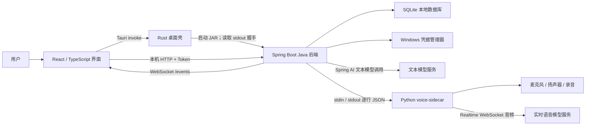
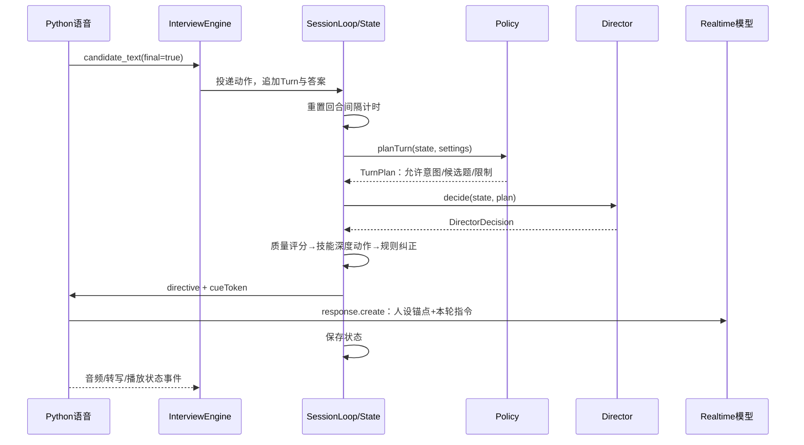
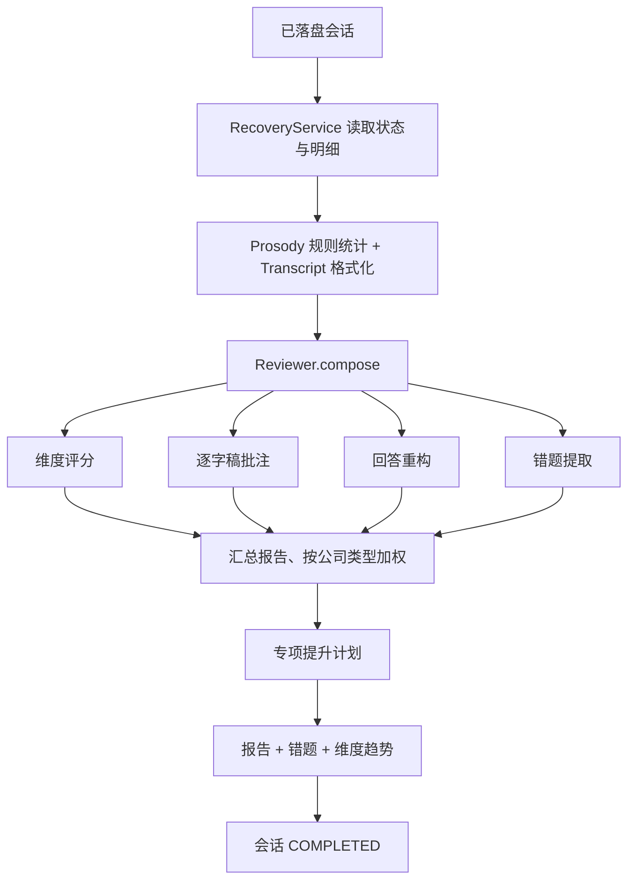

# AI 面试助手 Java 版：后端设计与全项目代码导读

> 扫描日期：2026-09-20。对象：本地 `interviewer-java` 目录当前快照。本文是现有实现说明，不是重新设计，也不是拟议功能清单。
>
> 扫描覆盖自有源码、配置、提示词、测试、类型契约、旧版参考代码和语料结构；核心启动、准备、面试、语音、复盘链路进行了重点追踪。没有启动应用、连接模型、访问个人凭据或执行测试，因此不把静态阅读等同于运行验证。版本以仓库声明为准，没有额外联网核验。
>
> 统计：214 个 Java 主源码文件，16,135 行；21 个 Java 测试目录文件，其中 20 个是 Test 类、1 个是 Parity 辅助类。附录逐文件列出 447 个已扫描文本文件，另列 PyInstaller spec、两份语料及图标资源。生成文件和旧版参考代码也明确标注用途。

## 阅读导航

- 第 1～3 节：项目是什么、技术栈、目录分层。
- 第 4～8 节：启动、准备、实时面试、复盘、代码运行的完整流程。
- 第 9～12 节：线程、数据库、接口、配置和测试。
- 第 13～15 节：实际实现边界、推荐读码顺序、项目介绍口径。
- 附录 A：所有已扫描文本文件的逐文件职责。
- 附录 B：二进制资源、工具产物与排除目录。

## 1. 先用一句话理解项目

这是一个 **Tauri 桌面应用 + Spring Boot 本机业务后端 + Python 实时语音子进程** 组成的 AI 模拟面试系统。

用户导入简历和岗位描述，选择面试官人设与时长；后端生成结构化资料和题库，用确定性规则与文本模型决定面试动作，实时语音模型负责表达；结束后生成复盘、错题和成长趋势。

它的核心不是普通 CRUD，也不是把一句提示词发给模型：重点是**让应用掌握状态、节奏和动作边界，模型在这些边界内工作**。

### 1.1 运行架构



三个边界必须分清：

1. **界面到 Java**：HTTP 发命令、取数据；WebSocket 收事件。
2. **Java 到 Python**：进程管道传命令、状态和转写；不传 PCM 音频流。
3. **应用到模型供应商**：Java 调文本模型；Python 连接实时语音服务。

这里的 `rpc` 是代码包名，实际使用 Spring MVC HTTP 和 WebSocket，不是 gRPC 或 Dubbo。

### 1.2 当前没有实现的技术，不要写成项目亮点

没有发现当前 Java 业务链路使用 Redis、RabbitMQ、MySQL、Spring Data JPA、Nacos、Seata 或分布式事务。数据库是 SQLite，访问框架是 MyBatis-Plus。

Spring Cloud Alibaba 在这里实际用于 **Sentinel 本机模型调用限流**。没有发现 LangGraph 或 Spring AI Alibaba 图编排的落地调用；Agent 流程由项目自己的 Java 代码实现。

有真题检索，但没有发现 Embedding、向量数据库、向量召回或 Reranker 链路。当前更准确的说法是“离线真题语料的关键词检索与题库补充”。

## 2. 用到了什么：依赖与落点

| 技术 | 仓库声明 | 实际作用 |
|---|---|---|
| Java | 17 | record、sealed interface、并发执行器、HTTP 客户端等 |
| Spring Boot | 3.5.10 | IoC、MVC、本机 HTTP 服务、生命周期管理 |
| Spring AI | 1.1.8，spring-ai-openai | 构造 OpenAiChatModel、发送 Prompt、读取模型响应 |
| Spring Cloud Alibaba | BOM 2025.0.0.0 | 引入 Sentinel；没有服务注册发现链路 |
| MyBatis-Plus | 3.5.17 | 实体基础 CRUD 与自定义 Mapper SQL |
| SQLite JDBC | 3.53.4.0 | 单文件数据库，配置 WAL、外键、busy_timeout |
| HikariCP | 由依赖体系提供 | 数据库连接池，最大连接数 4 |
| Jackson | Spring Boot 依赖体系 | JSON、snake_case 契约、状态和 payload 编解码 |
| Bean Validation | Spring Boot starter | HTTP 参数约束 |
| PDFBox / POI | 3.0.8 / 5.5.1 | 从 PDF / DOCX 提取简历和 JD 文本 |
| JNA | 5.19.1 | 调用 Windows Cred 系列 API 存取密钥 |
| springdoc-openapi | 2.8.9 | 导出 OpenAPI，作为前端类型生成源 |
| Caffeine | 声明 3.2.4 | pom 中存在，但未发现主源码实际调用；不能写成已落地缓存方案 |
| React / TypeScript / Vite | ^19.1.0 / ~5.8.3 / ^7.0.4 | 页面、类型检查与前端构建 |
| Tauri | 2 系列 | 原生窗口、进程管理、文件对话框与安装包 |
| Python | >=3.12,<3.13 | 独立实时语音进程，uv 管理 |
| websockets / sounddevice / numpy | 13.1 / 0.5.1 / 2.2.1 | 实时协议、PortAudio 采播、音频计算 |
| PyInstaller / jlink / NSIS | 见构建配置 | 语音程序、随包 Java 运行时、Windows 安装程序 |

证据入口：[backend/pom.xml](backend/pom.xml)、[desktop/package.json](desktop/package.json)、[voice-sidecar/pyproject.toml](voice-sidecar/pyproject.toml)。

## 3. 每个大目录在干什么

```text
interviewer-java/
├─ backend/
│  ├─ pom.xml
│  └─ src/
│     ├─ main/java/com/interviewer/
│     │  ├─ BackendApplication.java  后端入口
│     │  ├─ rpc/                    接口、鉴权、事件桥、请求响应 DTO
│     │  ├─ orchestration/          面试准备、主引擎、规则、锚点、复盘、恢复
│     │  ├─ agents/                 专项模型任务
│     │  ├─ llm/                    模型路由、调用、限流、提示词、JSON 解析
│     │  ├─ domain/                 面试状态、人设、题库、资料、复盘等业务模型
│     │  ├─ data/                   SQLite、Mapper、实体、仓储、真题检索
│     │  ├─ voice/                  Java 侧语音接口及 Python 子进程控制
│     │  ├─ analysis/               逐字稿、语速停顿统计、代码运行与判题
│     │  ├─ ingest/                 文件文本提取
│     │  └─ core/                   配置、密钥、类型、事件、异常、路径
│     ├─ main/resources/            yml、SQL、日志配置、提示词、压缩语料
│     └─ test/                      单测、集成测试、Python 对齐基准
├─ desktop/
│  ├─ src/                          React 页面、组件、接口客户端
│  ├─ src-tauri/                    Rust 外壳、原生能力、打包配置
│  └─ public/                       静态资源
├─ voice-sidecar/                   实际运行的 Python 语音模块
├─ tools/                           类型生成、语料编译和审计
├─ _reference/interviewer/           旧 Python 实现，迁移与对齐参考
├─ dist/                            打包中间产物 / 运行时资源
└─ 测试指南.md                      现有打包、运行和人工验证说明
```

### 3.1 后端分层的实际含义

- `rpc` 接收输入、进行基础校验、调用服务、形成 HTTP 响应。
- `orchestration` 组织跨模块流程，决定什么时候调用哪个 Agent、什么时候落库。
- `agents` 负责一个具体模型任务，不自行管理整场面试。
- `domain` 保存事实与业务规则；其中 `InterviewState` 不是单纯数据库行。
- `data/entity` 是表映射；`mapper` 是 SQL 访问；`repository` 负责领域对象与数据库行转换。
- `llm` 和 `voice` 是外部模型/进程的接入层。
- `core` 提供各层复用的类型、事件、配置和错误。

这是一套按职责分包的单体本机后端，不是多个独立部署的微服务。

## 4. 从点击桌面应用到后端可用

1. React 的 [backend.ts](desktop/src/lib/backend.ts) 调用 `ensureBackend()`；缓存启动 Promise，避免界面多处同时请求导致重复启动。
2. 通过 Tauri `invoke("backend_start")` 进入 [sidecar.rs](desktop/src-tauri/src/sidecar.rs)。
3. 开发模式启动 `backend/target/interviewer-backend.jar`，设置 `INTERVIEWER_VOICE_DIR`；打包模式使用资源目录中的 JRE、JAR 与语音 EXE。
4. [BackendApplication](backend/src/main/java/com/interviewer/BackendApplication.java) 创建随机 Token，启动仅监听 `127.0.0.1` 的 HTTP 服务，默认端口 0 由系统分配。
5. Web 服务初始化后，stdout 输出 `INTERVIEWER_RPC ` 前缀的 JSON，包含 host、port、token。日志走 stderr，避免污染握手。
6. Rust 返回 `http_base / ws_events / token`；界面开始请求接口并订阅 `/events`。
7. HTTP 通常携带 `X-Interviewer-Token`，WebSocket 握手通过查询参数传 token。
8. Java 监听 stdin 的 EOF 或 `shutdown` 指令关闭 Spring 上下文；Rust 的当前 shutdown 实现直接调用子进程 kill，不能把所有退出路径都描述为优雅退出。

[TokenGuard](backend/src/main/java/com/interviewer/rpc/TokenGuard.java) 使用恒时比较检查 Token，但 **OPTIONS 和 /v3/api-docs 路径放行**。所以不能写“所有请求无例外必须鉴权”。

## 5. 面试前：简历、岗位、差距、题库

### 5.1 简历和 JD 导入

```text
PrepareView
  → POST /prepare/resume 或 /prepare/job-file
  → PrepareController
  → PrepareService
  → DocumentReader 提取文本
  → ResumeAgent 调模型做结构化解析
  → LibraryRepository
  → Mapper → SQLite
```

桌面文件对话框返回本地路径，请求传路径，不是浏览器文件上传。支持 PDF、DOCX、TXT、MD；当前文件提取没有图像 OCR 链路。

简历会尝试复制到本地资料目录；解析结果是 `ResumeProfile`，岗位是 `JobDescription`。手动粘贴岗位走 `/prepare/job-text`；只填岗位名时，`JobSynthesizer` 生成模拟岗位描述，这种内容是模型合成，不等于真实公司的招聘原文。

### 5.2 差距诊断

`PrepareService.diagnose()` 按 resumeId、jobId 查询已有诊断；不强制刷新时可复用。需要重算时由 `ResumeAgent.analyzeGap()` 生成 `GapReport`。

诊断不只展示一个分数，还会影响：

- 哪些技能进入待考察清单；
- 哪些题被标为必问；
- 不同面试阶段的时间分配；
- 给模型的岗位与候选人背景。

### 5.3 创建面试会话

`POST /prepare/session → PrepareService.buildSession()`：

1. 读取简历、岗位和已有差距报告。
2. `Plans.build()` 根据人设、时长、编码开关、诊断安排阶段。
3. 简历和岗位都存在时，`BankBuilder.build()` **先生成技术题，再生成行为/编码口述题**；两次模型调用是顺序执行，不是并发。
4. 过滤过短题干、统一字段、按题干前 40 字的小写指纹去重；这不是语义去重。
5. `CorpusStore.search()` 查询离线语料，最多追加 10 条真题补充。
6. 按缺口标记必问题，创建 DRAFT 会话。
7. 组装 `InterviewState`：题库、计划、人设、资料摘要、待考技能等。
8. 保存完整状态，然后预热 director、assist、guard 模型链路。
9. 返回状态，前端持有准备结果供进入面试房间使用。

耗时操作仍通过原 HTTP 请求返回最终结果；进度通过 `task_progress` 事件按 `task_id` 关联。它不是带持久任务队列的后台作业系统。

### 5.4 真题检索的准确实现

[CorpusStore](backend/src/main/java/com/interviewer/data/corpus/CorpusStore.java) 读取 `resources/corpus/questions.bin`，zlib 解压后解析 JSON。当前资源有 **14,501 条**，与参考版语料文件哈希一致。

算法包括岗位方向门禁、技术词提取、停用词、英文词边界、关键词命中数、跨源频次排序与每类配额。结果直接补充到题库。缓存是加载后的 List 和 ConcurrentHashMap 正则缓存，未使用声明在 pom 中的 Caffeine。

`sources` 表示语料内的跨源出现次数，不表示经过本次独立核验的真实性；zlib 只是压缩，不是加密。

## 6. 面试中：规则、模型和语音怎样配合

### 6.1 开始一场面试

`POST /engine/start` 只传 `session_id`，控制器经 `RecoveryService.loadState()` 读回状态，再调用 `InterviewEngine.start()`。

引擎用 AtomicBoolean 限制同一进程只运行一场面试；创建专属 `SessionLoop`，进入 WARMUP，打开语音通道，把数据库状态改为 RUNNING，发送开场指令并启动 100ms 心跳。启动失败会清理语音与循环、释放运行标志，并尝试将会话恢复为 DRAFT。

### 6.2 用户回答后的一轮推进



具体顺序：

1. 临时转写用于界面；最终转写写入 `TurnRecord`，追加当前题答案和 `pendingAnswer`。
2. 等配置的 turn gap，且候选人不再说话，才触发推进；压力人设可增加停顿。
3. `Policy.planTurn()` 先计算允许意图、可选题、追问额度、剩余时间和必须覆盖项。
4. `Director.decide()` 把状态摘要、当前答案、候选题与约束发给文本模型。
5. 模型结果被解析和校验：非法意图被改判，题号必须在候选集内，新题的实际题干由题库决定。
6. `observeAnswer()` 更新技能进度；`Policy.enforceDepthAction()` 可以覆盖仍想追问的模型决策。
7. 更新技能覆盖和实时分，按需切阶段、开题、重锚，向语音模型发送执行指令。
8. 保存状态，行为题可另外启动 STAR 分析。

注意：“新题来自题库”主要描述导演的常规选题路径。开场自我介绍、反问回复、临时追问、收尾不是全部从题库逐字读取。

### 6.3 深度不是模型随意决定

[SkillProgress.observe()](backend/src/main/java/com/interviewer/domain/bank/SkillProgress.java) 的规则：

| 回答质量 | 动作 |
|---|---|
| >= 0.65 | 深入一层；达到最大深度后换领域 |
| >= 0.40 且 < 0.65 | 同层换角度；同层尝试达到阈值后换领域 |
| < 0.40 一次 | 同层换角度 |
| 连续两次 < 0.40 | 标记该技能停止深挖，ABANDON |
| 无质量值 | 按 0.5 进入规则 |

最大深度为 D4；追问次数还受人设与配置双重约束。质量分来自模型判断，而推进动作由程序计算，不能把整套评分都说成客观测量。

### 6.4 人设、Guard 与重新注入上下文

- `PersonaContract` 保存身份、表达风格、压力和考察偏好。
- `Anchor.buildInstructions()` 把人设、硬规则、工作流和当前状态编译成指令。
- `maybeReanchor()` 在阶段变化、周期或漂移时刷新锚点。
- Python 每轮 `response.create` 也组合当前锚点与导演指令。
- `Guard.inspect()` 先用正则检查，再按需调用语义模型；发现偏移后取消响应、清理展示线索、重锚并发送修复指令。

这些是约束与纠正措施，**不等于可以保证模型永不跑偏**。Guard 基于已拿到的面试官文本检查，不是所有音频播出前的同步审核屏障。

### 6.5 为什么界面不会只跟着模型生成时间走

文本决策和音频生成通常早于实际播放。项目用 `cueToken + leadMs + cueEpoch` 关联指令与音频：

- Java 暂存本轮问题和 DirectorDecided 展示事件；
- Python 返回音频线索及前面缓冲的等待时间；
- Java 延迟到预计开始播放时展示；
- 打断后 epoch 变化，旧轮次的待展示内容作废。

沉默计时依据“生成是否结束 + 播放缓冲是否清空”，而不是只看模型生成完成。6.5 秒沉默触发提词，15 秒触发轻推；具体逻辑见引擎的沉默计时函数。

## 7. Agent 到底有几个，怎么分工

当前 `agents/` 有 **10 个具体 Agent 实现 + Agent 基类 + AgentTasks 调用工具**。因此，这个 Java 快照不能直接讲成“12 个独立模型”。模型角色只有四组，多个 Agent 共享同一角色的路由配置；实时语音另算一条通道。

| Agent | 模型角色 | 输入与职责 |
|---|---|---|
| ResumeAgent | analyst | 解析简历、解析 JD、生成差距诊断 |
| JobSynthesizer | analyst | 根据岗位、级别和公司类型合成模拟 JD |
| BankBuilder | analyst | 生成题库，补充离线语料，标记必问题 |
| CodingComposer | analyst | 生成编码题、输入输出格式、用例、起始代码和参考解 |
| Director | director | 根据规则约束决定下一轮动作和问题 |
| CodeExaminer | director | 阅读候选人代码，生成评价与追问 |
| Guard | guard | 检查面试官输出的人设与行为偏移 |
| Copilot | assist | 给候选人关键词、提纲和提醒 |
| StarAnalyst | assist | 判断行为题的 STAR 要素与缺失环节 |
| Reviewer | analyst | 组织评分、批注、回答改写、错题和提升计划 |

调用方式是 **Service / Engine 显式调方法**，不是 Agent 自由互发消息，不是每个 Agent 都有独立进程。

### 7.1 模型调用链

```text
具体 Agent
 → Agent.client()
 → LlmRouter.client(role)
 → 配置中角色绑定的供应商、模型、超时
 → CredentialStore 读取 Key
 → Spring AI OpenAiChatModel
 → LlmRateLimiter 的 llm:<role> 资源
 → 外部文本模型
 → JsonExtract → LooseJson → Agent 原始 record → 领域对象
```

`LlmRouter` 按供应商、模型和超时缓存客户端；设置改变后清空缓存。使用 Spring AI 类库手工创建模型，没有使用要求全局 API Key 的 OpenAI starter 自动配置。

`LlmClient.structured()` 负责 JSON 输出模式、能力判断、解析失败后的纠正重试；HTTP 模型底层 RetryTemplate 配置为单次尝试。两者不是同一层重试。

`LooseJson` 处理模型输出的类型形态，`@JsonAlias` 处理键名差异。它能归一一些不规范输出，不能证明模型事实正确，也不能修复任意截断 JSON。

## 8. 语音、编码和复盘

### 8.1 语音通道

`VoiceChannel` 是 Java 编排层接口，`SidecarVoiceChannel` 负责转换命令，`VoiceSidecar` 管理 Python 进程、握手、UTF-8 管道及退出。

Python 侧：

- `main.py`：接收 connect / directive / reanchor / barge_in / cancel / mute / close，回传事件；50ms 推送一次状态。
- `client.py`：Realtime WebSocket 建链、音频上行、响应授权、转写、打断和播放事件。
- `protocol.py`：构造 session.update、audio append/commit、response.create/cancel 等协议载荷。
- `audio_io.py`：设备枚举、采集、自动增益、播放缓冲与电平。
- `echo_gate.py`：用麦克风与播放参考信号的相关性识别回声，抑制扬声器声音回流；不是完整通用 AEC 的保证。
- `recorder.py`：按时间轴记录两路音频、补齐空隙、重采样、最终合成录音。

协议关闭服务端自动回复与自动打断，发言由客户端授权。结束面试时回传 `audio_saved`，Java 等到录音路径后写入会话。实时服务的实际延迟与语音质量需实机验证，不能从代码推算性能承诺。

### 8.2 编码任务存在两条不同链路

**真正执行代码：**

`/coding/challenge → CodingComposer` 出题；`/coding/run → CodeRunner.run()` 自由运行；`/coding/judge → CodeRunner.judge()` 逐例运行并比较标准输出。

当前支持 Python 和 JavaScript；需要机器上可用的对应解释器。默认单次等待超时 6 秒，响应输出截取上限 8000 字符。CodeMirror 引入 Java 语法依赖不代表后端支持 Java 执行。

**让面试官阅读代码并追问：**

`/engine/code → InterviewEngine.submitCode() → CodeExaminer.probe() → 更新评分 → 语音追问`。

执行器结果与模型代码评价是两类证据；模型判断“正确”不等于测试用例通过。

### 8.3 结束与复盘

正常结束后同步 questions / turns、保存状态、记录时长与音频路径；普通结束标记 REVIEWING，中断标记 ABORTED。自然收尾会等待结束话语播放或达到等待上限。

`/engine/wait-finished` 会阻塞一个 HTTP 请求线程等待整场结束，符合本机单用户取舍，不是可直接外推的大规模长连接方案。

复盘链路：



四个子任务通过 `AgentTasks.allSettled()` 并发运行，总等待窗口 5 分钟；之后才生成提升计划。维度评分失败会终止报告；其他三项失败目前会记录在 `degradedSections`。这里是**记录仓库已有行为**，不是本次提出降级设计。

`Prosody` 从文本和转写时间计算语速、停顿、口头禅等，不是声学情绪识别。输入时间受转写链路影响，指标仍需按数据来源解释。

### 8.4 恢复不等于恢复现场语音

`RecoveryService.scan()` 检查最近 40 场记录中的 RUNNING 会话并改为 REVIEWING；`loadState()` 结合状态快照和逐字稿/题目明细恢复可读材料。这主要用于中断记录认领和复盘，不是恢复云端实时会话的全部音频上下文。

## 9. 线程与事件设计

| 线程或执行单元 | 实际工作 |
|---|---|
| HTTP 请求线程 | 接口校验、同步服务调用、等待面试结束 |
| SessionLoop | 单线程 scheduled executor，串行处理核心状态变更、回合计时、心跳 |
| engine-guard / engine-star / engine-copilot / engine-code | 调专项模型，结果按需投回事件循环 |
| AgentTasks | 0～32 线程、SynchronousQueue、CallerRunsPolicy；Future 等待与取消 |
| engine-persist | 单轮转写与题目异步保存 |
| voice-stdout / voice-stderr | 读 Python 回传事件和日志 |
| rpc-event-pump | 每 50ms 向 WebSocket 客户端发送事件 |
| Python asyncio / PortAudio 回调 | 实时网络、语音采播、命令处理 |

`EventBus` 是 JVM 进程内同步发布订阅，不是 MQ。订阅方不能长期阻塞。EventHub 先序列化事件快照，再排入容量 256 的队列；满时丢最旧事件。audio_level 和 elapsed_tick 只保留最新值。

这条事件链没有消息落盘、ACK、重放和消费确认，不能宣称可靠消息队列或 exactly-once。

**需要准确说明的边界：** 当前 `InterviewEngine.runTurn()` 在 SessionLoop 中直接调用同步的 `Director.decide()`，模型网络耗时可能阻塞 Java 状态循环。语音在独立 Python 进程运行不代表 Java 回调、心跳也完全不受影响。HTTP 还可取得 state 引用，因此“所有读写都绝对单线程、没有任何竞争”不是可以直接下的结论。

## 10. 数据库怎么设计、怎么写

### 10.1 十张表

| 表 | 内容 | 关系/关键约束 |
|---|---|---|
| personas | 人设与使用信息 | name 唯一；完整人设在 payload |
| resumes | 简历原文结构化结果和副本路径 | payload 保存 ResumeProfile |
| jobs | 岗位描述 | company/title 便于查询；完整内容在 payload |
| gap_reports | 简历和岗位的差距报告 | resume_id + job_id 普通联合索引，不是唯一约束 |
| sessions | 面试主记录、状态、时长、音频路径 | state 存完整状态；关联人设、简历、岗位 |
| turns | 一次发言 | session_id + turn_index 唯一 |
| questions | 一道已提出的问题和回答 | session_id + question_index 唯一 |
| reviews | 最终报告 | session_id 唯一，一场一份 |
| mistakes | 知识点错误、次数、掌握状态 | 按未掌握知识点合并 |
| skill_trends | 单场的维度评分 | session_id + dimension 唯一 |

[SQL 全量定义](backend/src/main/resources/schema.sql)。

设计是“结构化查询列 + JSON 大对象”：列表、筛选、聚合走普通列，完整领域快照走 JSON。不是把所有查询都变成解析 JSON，也不是把每个领域字段都拆成关系表列。

### 10.2 一次写入的调用关系

`Service/Engine → Repository → Entity Row + JsonCodec → Mapper → SQLite`。

例如：`SessionRepository.persistState()` 序列化状态写入 sessions；`upsertTurn()` 转换 TurnRecord 后按自然键更新；`ReviewRepository.saveReview()` 顺序写报告、合并错题、写趋势。

Mapper 的 upsert 会选择性更新可变字段，避免复写原始身份与时间信息。收尾同步按 80 条分批调用，而不是一次装入一个无限大批次。

SQLite 配置：WAL、synchronous=NORMAL、foreign_keys=ON、busy_timeout=8000、cache_size=-32000、temp_store=MEMORY。WAL 支持读写并存，但 SQLite 仍然不是多写者数据库。

### 10.3 事务的实际边界

仓库有 `@Transactional` 标注，但 `SessionRepository.syncRecords()` 同类调用 `flushQuestions/flushTurns`，`ReviewRepository.saveReview()` 同类调用 `saveReportBody/saveTrend`。在当前常规 Spring 代理模式下，这些内部调用不会因为被调方法的注解自动获得新事务边界。

所以“每个批次已保证事务提交”“报告与主表分数必然原子更新”不能只依据注释宣称。本次仅记录这一实现边界，没有改动事务设计。

## 11. 配置、接口与前后端契约

### 11.1 三种配置不要混淆

1. `application.yml`：服务端监听、Jackson、MyBatis、springdoc、模型超时/QPS、语音握手等工程配置。
2. 用户 `config.json`：角色模型绑定、音频、人设相关开关等 AppSettings。
3. Windows 凭据管理器：API Key；目标名 `Interviewer.AI:<供应商>`，不写入 config.json。

Windows 默认数据根目录为 `%LOCALAPPDATA%/Interviewer`，含 interviewer.db、config.json、logs、audio、exports、resumes。Java 系统属性 `interviewer.dataRoot` 可覆盖根目录，语音子进程通过 `INTERVIEWER_DATA_ROOT` 获取同一位置。

### 11.2 API 清单

控制器共声明 46 个 HTTP 操作，对应路径有复用；前端 API 快照包含 44 个唯一路径。WebSocket 的 /events 单独注册。

下面按实际控制器注解列出，最终请求字段以对应 Body/record 和 OpenAPI 为准：

| 方法 | 路径 | 控制器 |
|---|---|---|
| POST | `/coding/challenge` | [CodingController.java](backend/src/main/java/com/interviewer/rpc/CodingController.java) |
| POST | `/coding/run` | [CodingController.java](backend/src/main/java/com/interviewer/rpc/CodingController.java) |
| POST | `/coding/judge` | [CodingController.java](backend/src/main/java/com/interviewer/rpc/CodingController.java) |
| GET | `/catalog` | [ConfigController.java](backend/src/main/java/com/interviewer/rpc/ConfigController.java) |
| GET | `/audio/devices` | [ConfigController.java](backend/src/main/java/com/interviewer/rpc/ConfigController.java) |
| POST | `/config/probe` | [ConfigController.java](backend/src/main/java/com/interviewer/rpc/ConfigController.java) |
| GET | `/config` | [ConfigController.java](backend/src/main/java/com/interviewer/rpc/ConfigController.java) |
| POST | `/config` | [ConfigController.java](backend/src/main/java/com/interviewer/rpc/ConfigController.java) |
| GET | `/config/keys/{provider_key}` | [ConfigController.java](backend/src/main/java/com/interviewer/rpc/ConfigController.java) |
| POST | `/config/keys` | [ConfigController.java](backend/src/main/java/com/interviewer/rpc/ConfigController.java) |
| POST | `/engine/start` | [EngineController.java](backend/src/main/java/com/interviewer/rpc/EngineController.java) |
| POST | `/engine/stop` | [EngineController.java](backend/src/main/java/com/interviewer/rpc/EngineController.java) |
| POST | `/engine/wait-finished` | [EngineController.java](backend/src/main/java/com/interviewer/rpc/EngineController.java) |
| POST | `/engine/mute` | [EngineController.java](backend/src/main/java/com/interviewer/rpc/EngineController.java) |
| POST | `/engine/hint` | [EngineController.java](backend/src/main/java/com/interviewer/rpc/EngineController.java) |
| POST | `/engine/interrupt` | [EngineController.java](backend/src/main/java/com/interviewer/rpc/EngineController.java) |
| POST | `/engine/code` | [EngineController.java](backend/src/main/java/com/interviewer/rpc/EngineController.java) |
| POST | `/engine/finish-early` | [EngineController.java](backend/src/main/java/com/interviewer/rpc/EngineController.java) |
| GET | `/library/resumes` | [LibraryController.java](backend/src/main/java/com/interviewer/rpc/LibraryController.java) |
| GET | `/library/jobs` | [LibraryController.java](backend/src/main/java/com/interviewer/rpc/LibraryController.java) |
| GET | `/info` | [MetaController.java](backend/src/main/java/com/interviewer/rpc/MetaController.java) |
| GET | `/mistakes` | [MistakesController.java](backend/src/main/java/com/interviewer/rpc/MistakesController.java) |
| GET | `/mistakes/counts` | [MistakesController.java](backend/src/main/java/com/interviewer/rpc/MistakesController.java) |
| GET | `/mistakes/topics` | [MistakesController.java](backend/src/main/java/com/interviewer/rpc/MistakesController.java) |
| POST | `/mistakes/mastered` | [MistakesController.java](backend/src/main/java/com/interviewer/rpc/MistakesController.java) |
| DELETE | `/mistakes/{mistake_id}` | [MistakesController.java](backend/src/main/java/com/interviewer/rpc/MistakesController.java) |
| GET | `/trends/overall` | [MistakesController.java](backend/src/main/java/com/interviewer/rpc/MistakesController.java) |
| GET | `/trends/dimensions` | [MistakesController.java](backend/src/main/java/com/interviewer/rpc/MistakesController.java) |
| GET | `/personas` | [PersonaController.java](backend/src/main/java/com/interviewer/rpc/PersonaController.java) |
| POST | `/personas` | [PersonaController.java](backend/src/main/java/com/interviewer/rpc/PersonaController.java) |
| DELETE | `/personas/{persona_id}` | [PersonaController.java](backend/src/main/java/com/interviewer/rpc/PersonaController.java) |
| POST | `/personas/unique-name` | [PersonaController.java](backend/src/main/java/com/interviewer/rpc/PersonaController.java) |
| POST | `/prepare/session` | [PrepareController.java](backend/src/main/java/com/interviewer/rpc/PrepareController.java) |
| POST | `/prepare/resume` | [PrepareController.java](backend/src/main/java/com/interviewer/rpc/PrepareController.java) |
| POST | `/prepare/job-file` | [PrepareController.java](backend/src/main/java/com/interviewer/rpc/PrepareController.java) |
| POST | `/prepare/job-text` | [PrepareController.java](backend/src/main/java/com/interviewer/rpc/PrepareController.java) |
| POST | `/prepare/job-synthesize` | [PrepareController.java](backend/src/main/java/com/interviewer/rpc/PrepareController.java) |
| POST | `/prepare/diagnose` | [PrepareController.java](backend/src/main/java/com/interviewer/rpc/PrepareController.java) |
| POST | `/recovery/scan` | [RecoveryController.java](backend/src/main/java/com/interviewer/rpc/RecoveryController.java) |
| POST | `/review/generate` | [ReviewController.java](backend/src/main/java/com/interviewer/rpc/ReviewController.java) |
| GET | `/review/{session_id}` | [ReviewController.java](backend/src/main/java/com/interviewer/rpc/ReviewController.java) |
| GET | `/sessions` | [SessionsController.java](backend/src/main/java/com/interviewer/rpc/SessionsController.java) |
| GET | `/sessions/stats` | [SessionsController.java](backend/src/main/java/com/interviewer/rpc/SessionsController.java) |
| GET | `/sessions/{session_id}/state` | [SessionsController.java](backend/src/main/java/com/interviewer/rpc/SessionsController.java) |
| GET | `/sessions/{session_id}/turns` | [SessionsController.java](backend/src/main/java/com/interviewer/rpc/SessionsController.java) |
| GET | `/sessions/{session_id}/status` | [SessionsController.java](backend/src/main/java/com/interviewer/rpc/SessionsController.java) |

### 11.3 类型生成链路

`Controller/DTO/AppEvent + Jackson → /v3/api-docs → tools/gen_frontend_types.py → api-spec.json / api-schema.d.ts / event-types.ts`。

HTTP 与事件使用 snake_case；事件载荷在 OpenAPI 的 components 中注册，事件名映射放在 `x-interviewer-events` 扩展。当前事件家族有 21 类。事件类型存在不代表每一种在所有业务路径都会实际触发。

## 12. 测试、运行与打包

### 12.1 现有测试覆盖了什么

- Parity：人设、排期、题库、提示词、JSON 归一、数字格式与 Python 基准对比。
- DataLayerTest：实际 SQLite 建表、读写与查询行为。
- ApiContractTest / WireFormatTest：路由、schema、snake_case、枚举和可空字段。
- SessionLoopTest：循环顺序、计时与关闭行为。
- VoiceSidecarTest：子进程启动与行协议。
- CredentialStoreTest：Windows 凭据库的测试目标读写。
- CodeRunnerTest：本机代码运行、输出与超时。
- ModelTraitsTest：模型能力判断。

这些测试的存在不等于本次已跑通，也不证明所有长会话、网络和声音设备场景正确。本次没有执行这些测试，避免把写文档扩成运行模型或修改机器状态。

### 12.2 仓库提供的命令与依赖关系

| 目录 | 已有命令/入口 | 作用 |
|---|---|---|
| backend | mvn test | 执行测试；Surefire 指向 target/test-data |
| backend | mvn package | 构建 Spring Boot JAR |
| desktop | npm run typecheck | TypeScript 类型检查 |
| desktop | npm run build | 前端类型检查与 Vite 构建 |
| desktop | npm run gen:types | 用 uv 运行类型生成器，会启动已构建 JAR |
| desktop | npm run tauri dev | 启动桌面开发环境，需已有后端 JAR |
| desktop | npm run bundle | 串行打包后端、JRE、Python 语音和 Tauri |
| voice-sidecar | uv run python -m voice.main | 语音行协议程序，通常由 Java 启动 |

`bundle` 中的后端构建使用 `-DskipTests`，所以“打包成功”不等于“测试通过”。该表是现有入口说明，本次没有执行。

参考 [测试指南.md](测试指南.md)。`_reference` 不是当前 Java 后端的运行入口，不能用旧 Python 的行为代替 Java 代码事实。

## 13. 面试时必须讲准确的边界

| 容易说过头的描述 | 当前代码支持的说法 |
|---|---|
| 12 个模型独立协作 | 10 个具体 Agent 类复用 4 类文本模型角色，另有实时语音通道 |
| 用了微服务、MQ 和 Redis | 本机 Spring Boot 单体，内部事件总线 + WebSocket + 子进程管道 |
| 向量 RAG 真题知识库 | 压缩离线真题、关键词检索、频次和分类筛选、题库补充 |
| Agent 保证绝不漂移 | 权威状态、规则限制、重复注入和 Guard 检测降低并纠正偏移 |
| 并发复盘完全无失败 | 四任务并发，有超时；评分失败终止，其他部分有现存缺项处理 |
| 任意代码安全沙箱 | 本机子进程运行器；没有容器、文件系统、网络权限隔离 |
| 完整恢复被打断的面试 | 根据快照与明细恢复记录，并支持复盘，不恢复实时服务全部上下文 |
| 全部耗时调用都不阻塞循环 | Guard 等旁路任务另起线程，Director 目前同步占用 SessionLoop |
| 所有接口都需要 token | 业务接口校验 token，OpenAPI 与 OPTIONS 有明确例外 |
| 使用了 Caffeine 缓存 | pom 声明依赖，当前源码实际缓存主要是 List / Map |

其他直接可见的限制：CodeRunner 在读取完整进程输出后才截取响应文本，不等于严格限制子进程内存；超时 kill 也不是完整的进程树资源隔离。ConfigStore.save() 捕获写盘异常后只记录日志，HTTP 调用方不能仅靠正常返回判断配置已持久化。这里未新增方案，只解释当前代码能保证什么。

## 14. 建议你按这个顺序读代码

第一遍只抓主线：

1. `BackendApplication → desktop/src-tauri/src/sidecar.rs → desktop/src/lib/backend.ts`：先明白进程怎么连起来。
2. `PrepareController → PrepareService → ResumeAgent / BankBuilder`：看资料怎么成为会话。
3. `InterviewState → Plans → SkillProgress`：弄清状态、阶段、深度。
4. `EngineController → InterviewEngine.runTurn → Policy → Director`：看一次回答怎么影响下一题。
5. `Anchor → SidecarVoiceChannel → voice/main.py → voice/client.py`：看决策怎么变成语音。
6. `ReviewService → Reviewer → ReviewRepository`：看报告怎么生成和保存。
7. `SessionRepository → Mapper → schema.sql`：再细看持久层。

第二遍按一个真实动作追踪：在源码中查 `/engine/hint`，从 room.tsx 找到请求，再到控制器、引擎、Copilot、LlmRouter，最后跟随 copilot_hint 事件回到界面。这个动作短，适合检验自己是否真正看懂了项目调用链。

## 15. 一段可以据实讲的项目介绍

> 我做的是一个桌面 AI 模拟面试系统。前端使用 React 和 Tauri，Java Spring Boot 后端在本机运行，SQLite 保存面试资料与记录，Python 子进程处理实时语音。准备阶段会解析简历和 JD，生成差距分析与个性化题库。面试阶段由程序保存权威状态，先用规则限定候选题和动作，再让 Director 决策，实时语音模型负责表达；另外用 Guard、人设重锚和深度规则控制对话。结束后并发生成评分、批注、回答重构和错题，再形成训练建议与成长记录。文本模型调用通过 Spring AI 统一接入，并使用 Sentinel 做本机限流。

技术描述不等于个人工作证明。哪些部分你亲自设计、哪些由 AI 协助、哪些沿用旧实现，需要按你的真实开发过程补充；不要将本导读直接当作“全部独立手写”的声明。

---

## 附录 A：逐文件职责索引

以下按目录列出扫描到的文本文件，名称可点击。职责由源码结构、声明和调用关系整理；关键设计与限制以上文为准。生成类型文件、锁文件和参考实现会明确标识，不要求逐行背诵。

### `项目根目录`

| 文件 | 行数 | 职责 |
|---|---:|---|
| [.gitignore](.gitignore) | 120 | 当前目录的版本控制忽略规则。 |
| [测试指南.md](测试指南.md) | 307 | 现有开发运行、打包、测试与人工检查步骤。 |
| [LICENSE](LICENSE) | 674 | GNU Affero General Public License 第 3 版许可文本。 |

### `backend`

| 文件 | 行数 | 职责 |
|---|---:|---|
| [pom.xml](backend/pom.xml) | 204 | Java 构建、依赖版本、JAR 入口、测试数据目录和 UTF-8 编译设置。 |

### `backend/src/main/java/com/interviewer`

| 文件 | 行数 | 职责 |
|---|---:|---|
| [BackendApplication.java](backend/src/main/java/com/interviewer/BackendApplication.java) | 166 | Spring Boot 入口：本机端口、随机 Token、stdout 握手和 stdin 生命周期监控。 |

### `backend/src/main/java/com/interviewer/agents`

| 文件 | 行数 | 职责 |
|---|---:|---|
| [Agent.java](backend/src/main/java/com/interviewer/agents/Agent.java) | 24 | 所有 Agent 的共同外壳。角色决定它用哪个模型。 |
| [AgentTasks.java](backend/src/main/java/com/interviewer/agents/AgentTasks.java) | 111 | 共享线程池中的模型子任务调度、超时等待、取消与结果汇集。 |
| [BankBuilder.java](backend/src/main/java/com/interviewer/agents/BankBuilder.java) | 314 | 顺序生成技术题和软性题，清洗去重、补充语料并标记必问。 |
| [CodeExaminer.java](backend/src/main/java/com/interviewer/agents/CodeExaminer.java) | 90 | 读候选人的代码，产出一个真人式的追问。不给答案。 |
| [CodingComposer.java](backend/src/main/java/com/interviewer/agents/CodingComposer.java) | 132 | 出一道能自动判题的编码题。 |
| [Copilot.java](backend/src/main/java/com/interviewer/agents/Copilot.java) | 89 | 生成候选人关键词与回答提纲，供手动提示和沉默触发使用。 |
| [Director.java](backend/src/main/java/com/interviewer/agents/Director.java) | 246 | 面试的大脑。它不说话，只在 policy 划定的边界内决定下一步。 |
| [Guard.java](backend/src/main/java/com/interviewer/agents/Guard.java) | 166 | 正则和模型语义检测面试官输出的偏移，返回修复信息。 |
| [JobSynthesizer.java](backend/src/main/java/com/interviewer/agents/JobSynthesizer.java) | 123 | 根据岗位名称等输入合成模拟 JD，并组装供诊断使用的原文。 |
| [ResumeAgent.java](backend/src/main/java/com/interviewer/agents/ResumeAgent.java) | 327 | 调用 analyst 模型解析简历、岗位需求并生成差距报告。 |
| [Reviewer.java](backend/src/main/java/com/interviewer/agents/Reviewer.java) | 544 | 并发组织评分、批注、回答重构和错题，再生成提升计划。 |
| [StarAnalyst.java](backend/src/main/java/com/interviewer/agents/StarAnalyst.java) | 89 | 行为题的 STAR 完整度判定。近线执行，不阻塞对话。 |

### `backend/src/main/java/com/interviewer/analysis`

| 文件 | 行数 | 职责 |
|---|---:|---|
| [CodeRunner.java](backend/src/main/java/com/interviewer/analysis/CodeRunner.java) | 318 | 启动本机 Python/Node 子进程运行代码与判题；处理输入输出及超时，不是隔离安全沙箱。 |
| [Prosody.java](backend/src/main/java/com/interviewer/analysis/Prosody.java) | 222 | 基于转写文本及时间戳计算语速、停顿和口头禅等统计。 |
| [Transcript.java](backend/src/main/java/com/interviewer/analysis/Transcript.java) | 58 | 逐字稿格式化。 |

### `backend/src/main/java/com/interviewer/core`

| 文件 | 行数 | 职责 |
|---|---:|---|
| [AppPaths.java](backend/src/main/java/com/interviewer/core/AppPaths.java) | 97 | 用户数据根目录，随平台落到标准位置。 |
| [Text.java](backend/src/main/java/com/interviewer/core/Text.java) | 126 | 文本裁剪、空值处理、时间和数字格式化等共用函数。 |

### `backend/src/main/java/com/interviewer/core/config`

| 文件 | 行数 | 职责 |
|---|---:|---|
| [AppSettings.java](backend/src/main/java/com/interviewer/core/config/AppSettings.java) | 105 | 全部明文配置。密钥不在这里——那些进系统凭据库。 |
| [AudioSettings.java](backend/src/main/java/com/interviewer/core/config/AudioSettings.java) | 70 | 音频采集与播放参数。真正干活的是 Python 语音 sidecar，握手时整份下发给它。 |
| [Clamp.java](backend/src/main/java/com/interviewer/core/config/Clamp.java) | 29 | 配置项的范围钳制。 |
| [ConfigStore.java](backend/src/main/java/com/interviewer/core/config/ConfigStore.java) | 87 | 加载/保存用户 JSON 配置；锁保护写入，临时文件原子替换，现存失败行为见正文。 |
| [CredentialStore.java](backend/src/main/java/com/interviewer/core/config/CredentialStore.java) | 135 | API Key 的唯一出入口。密钥进 Windows 凭据管理器，绝不落到配置文件里。 |
| [FeatureSettings.java](backend/src/main/java/com/interviewer/core/config/FeatureSettings.java) | 14 | 功能开关。 |
| [OrchestrationSettings.java](backend/src/main/java/com/interviewer/core/config/OrchestrationSettings.java) | 52 | 编排引擎的可调参数。这些值决定节奏，不决定内容。 |
| [RealtimeSettings.java](backend/src/main/java/com/interviewer/core/config/RealtimeSettings.java) | 47 | 实时语音的供应商、模型与音色。 |
| [WinCred.java](backend/src/main/java/com/interviewer/core/config/WinCred.java) | 74 | Windows 凭据管理器的 JNA 映射。 |

### `backend/src/main/java/com/interviewer/core/error`

| 文件 | 行数 | 职责 |
|---|---:|---|
| [AudioDeviceException.java](backend/src/main/java/com/interviewer/core/error/AudioDeviceException.java) | 13 | 音频设备异常，提供业务分类与用户提示。 |
| [ConfigException.java](backend/src/main/java/com/interviewer/core/error/ConfigException.java) | 21 | 配置异常，提供业务分类与用户提示。 |
| [CredentialMissingException.java](backend/src/main/java/com/interviewer/core/error/CredentialMissingException.java) | 13 | 缺失密钥异常，提供业务分类与用户提示。 |
| [InterviewBusyException.java](backend/src/main/java/com/interviewer/core/error/InterviewBusyException.java) | 13 | 已有面试运行异常，提供业务分类与用户提示。 |
| [InterviewerException.java](backend/src/main/java/com/interviewer/core/error/InterviewerException.java) | 55 | 应用内所有异常的根，便于接口层统一拦截展示。 |
| [ProviderException.java](backend/src/main/java/com/interviewer/core/error/ProviderException.java) | 40 | 模型服务调用失败。 |
| [ProviderResponseException.java](backend/src/main/java/com/interviewer/core/error/ProviderResponseException.java) | 21 | 供应商响应异常，提供业务分类与用户提示。 |
| [RateLimitedException.java](backend/src/main/java/com/interviewer/core/error/RateLimitedException.java) | 18 | 本机限流拦截。 |
| [RealtimeClosedException.java](backend/src/main/java/com/interviewer/core/error/RealtimeClosedException.java) | 13 | 实时连接关闭异常，提供业务分类与用户提示。 |
| [RealtimeException.java](backend/src/main/java/com/interviewer/core/error/RealtimeException.java) | 17 | 实时连接异常，提供业务分类与用户提示。 |
| [ResumeParseException.java](backend/src/main/java/com/interviewer/core/error/ResumeParseException.java) | 17 | 简历解析异常，提供业务分类与用户提示。 |
| [StateTransitionException.java](backend/src/main/java/com/interviewer/core/error/StateTransitionException.java) | 13 | 状态转换异常，提供业务分类与用户提示。 |

### `backend/src/main/java/com/interviewer/core/event`

| 文件 | 行数 | 职责 |
|---|---:|---|
| [AppEvent.java](backend/src/main/java/com/interviewer/core/event/AppEvent.java) | 127 | 所有事件的封闭家族。 |
| [EventBus.java](backend/src/main/java/com/interviewer/core/event/EventBus.java) | 75 | 进程内同步发布订阅；支持按类型订阅和全量订阅。 |

### `backend/src/main/java/com/interviewer/core/provider`

| 文件 | 行数 | 职责 |
|---|---:|---|
| [ChatProvider.java](backend/src/main/java/com/interviewer/core/provider/ChatProvider.java) | 23 | 文本模型接入点定义：供应商标识、地址和模型目录。 |
| [CustomEndpoint.java](backend/src/main/java/com/interviewer/core/provider/CustomEndpoint.java) | 29 | 自定义端点的用户填写值。 |
| [ModelTraits.java](backend/src/main/java/com/interviewer/core/provider/ModelTraits.java) | 41 | 按模型名称判断推理属性、JSON 输出与采样参数能力。 |
| [Providers.java](backend/src/main/java/com/interviewer/core/provider/Providers.java) | 189 | 供应商、模型、音色与角色的静态目录。 |
| [RealtimeProvider.java](backend/src/main/java/com/interviewer/core/provider/RealtimeProvider.java) | 19 | 端到端实时语音接入点，协议为 OpenAI Realtime 事件风格。 |
| [RoleBinding.java](backend/src/main/java/com/interviewer/core/provider/RoleBinding.java) | 23 | 一个文本角色绑定的模型。四个角色可分别指定，以平衡成本与质量。 |

### `backend/src/main/java/com/interviewer/core/type`

| 文件 | 行数 | 职责 |
|---|---:|---|
| [AnnotationKind.java](backend/src/main/java/com/interviewer/core/type/AnnotationKind.java) | 41 | 逐字稿批注种类。 |
| [CompanyTier.java](backend/src/main/java/com/interviewer/core/type/CompanyTier.java) | 46 | 公司类型。它决定考什么、怎么问、以及分数怎么加权。 |
| [Depth.java](backend/src/main/java/com/interviewer/core/type/Depth.java) | 28 | 深度阶梯。加深还是换领域，由这四级决定，不交给模型自由裁量。 |
| [DriftKind.java](backend/src/main/java/com/interviewer/core/type/DriftKind.java) | 56 | 人格漂移的具体形态，Guard 命中后用于决定修复动作。 |
| [GapSeverity.java](backend/src/main/java/com/interviewer/core/type/GapSeverity.java) | 47 | 排序权重。缺口越致命越靠前，复盘与诊断都按这个排。 |
| [InterviewPhase.java](backend/src/main/java/com/interviewer/core/type/InterviewPhase.java) | 53 | 面试阶段，导演据此收敛提问范围。 |
| [JobLevel.java](backend/src/main/java/com/interviewer/core/type/JobLevel.java) | 48 | 岗位级别枚举及经验提示。 |
| [Labeled.java](backend/src/main/java/com/interviewer/core/type/Labeled.java) | 40 | 带线上值与中文名的枚举。 |
| [QuestionSource.java](backend/src/main/java/com/interviewer/core/type/QuestionSource.java) | 51 | 题目来源。决定这道题为什么值得问，也决定它能不能被跳过。 |
| [ScoreDimension.java](backend/src/main/java/com/interviewer/core/type/ScoreDimension.java) | 43 | 技术深度、表达、抗压、价值观、编码、协作等评分维度。 |
| [SessionStatus.java](backend/src/main/java/com/interviewer/core/type/SessionStatus.java) | 42 | 数据库会话状态枚举，与面试阶段枚举分开。 |
| [Speaker.java](backend/src/main/java/com/interviewer/core/type/Speaker.java) | 39 | 发言人枚举：候选人或面试官。 |
| [StarElement.java](backend/src/main/java/com/interviewer/core/type/StarElement.java) | 41 | STAR 的情境、任务、行动、结果要素枚举。 |
| [TurnIntent.java](backend/src/main/java/com/interviewer/core/type/TurnIntent.java) | 63 | 导演下发给实时模型的意图，实时模型只负责用人设语气表达。 |

### `backend/src/main/java/com/interviewer/data`

| 文件 | 行数 | 职责 |
|---|---:|---|
| [SqliteConfig.java](backend/src/main/java/com/interviewer/data/SqliteConfig.java) | 107 | 建立 Hikari 数据源、SQLite PRAGMA 设置，并执行 schema.sql。 |
| [UtcStamp.java](backend/src/main/java/com/interviewer/data/UtcStamp.java) | 59 | 数据库里的时间戳。 |
| [UtcStampTypeHandler.java](backend/src/main/java/com/interviewer/data/UtcStampTypeHandler.java) | 42 | 时间戳按 SQLAlchemy 的 SQLite 文本格式读写。 |

### `backend/src/main/java/com/interviewer/data/corpus`

| 文件 | 行数 | 职责 |
|---|---:|---|
| [CorpusStore.java](backend/src/main/java/com/interviewer/data/corpus/CorpusStore.java) | 313 | 真题语料的只读检索。 |
| [RealQuestion.java](backend/src/main/java/com/interviewer/data/corpus/RealQuestion.java) | 10 | 离线真题条目：分类、问题文本与跨源出现次数。 |

### `backend/src/main/java/com/interviewer/data/dto`

| 文件 | 行数 | 职责 |
|---|---:|---|
| [GlobalStats.java](backend/src/main/java/com/interviewer/data/dto/GlobalStats.java) | 14 | 工作台的统计卡片。 |
| [SessionSummary.java](backend/src/main/java/com/interviewer/data/dto/SessionSummary.java) | 13 | 列表页用的会话摘要。不含 state，那是几十 KB 的大 JSON。 |
| [StoredGap.java](backend/src/main/java/com/interviewer/data/dto/StoredGap.java) | 6 | 带数据库 ID 和关联简历/岗位 ID 的诊断对象。 |
| [StoredJob.java](backend/src/main/java/com/interviewer/data/dto/StoredJob.java) | 6 | 带数据库 ID、标签的岗位对象。 |
| [StoredMistake.java](backend/src/main/java/com/interviewer/data/dto/StoredMistake.java) | 10 | 错题本条目。hitCount 是同一知识点累计答错的次数。 |
| [StoredResume.java](backend/src/main/java/com/interviewer/data/dto/StoredResume.java) | 6 | 带数据库 ID、标签和文件路径的简历对象。 |
| [TrendPoint.java](backend/src/main/java/com/interviewer/data/dto/TrendPoint.java) | 6 | 成长曲线中的会话、时间和评分点。 |

### `backend/src/main/java/com/interviewer/data/entity`

| 文件 | 行数 | 职责 |
|---|---:|---|
| [GapReportRow.java](backend/src/main/java/com/interviewer/data/entity/GapReportRow.java) | 25 | 差距报告数据库行映射；将表列与 JSON payload 字段交给 MyBatis。 |
| [JobRow.java](backend/src/main/java/com/interviewer/data/entity/JobRow.java) | 25 | 岗位数据库行映射；将表列与 JSON payload 字段交给 MyBatis。 |
| [MistakeRow.java](backend/src/main/java/com/interviewer/data/entity/MistakeRow.java) | 35 | 错题数据库行映射；将表列与 JSON payload 字段交给 MyBatis。 |
| [PersonaRow.java](backend/src/main/java/com/interviewer/data/entity/PersonaRow.java) | 30 | 人设数据库行映射；将表列与 JSON payload 字段交给 MyBatis。 |
| [QuestionRow.java](backend/src/main/java/com/interviewer/data/entity/QuestionRow.java) | 29 | 问题记录数据库行映射；将表列与 JSON payload 字段交给 MyBatis。 |
| [ResumeRow.java](backend/src/main/java/com/interviewer/data/entity/ResumeRow.java) | 24 | 简历数据库行映射；将表列与 JSON payload 字段交给 MyBatis。 |
| [ReviewRow.java](backend/src/main/java/com/interviewer/data/entity/ReviewRow.java) | 24 | 复盘数据库行映射；将表列与 JSON payload 字段交给 MyBatis。 |
| [SessionRow.java](backend/src/main/java/com/interviewer/data/entity/SessionRow.java) | 39 | 会话数据库行映射；将表列与 JSON payload 字段交给 MyBatis。 |
| [SkillTrendRow.java](backend/src/main/java/com/interviewer/data/entity/SkillTrendRow.java) | 23 | 维度趋势数据库行映射；将表列与 JSON payload 字段交给 MyBatis。 |
| [TurnRow.java](backend/src/main/java/com/interviewer/data/entity/TurnRow.java) | 27 | 发言数据库行映射；将表列与 JSON payload 字段交给 MyBatis。 |

### `backend/src/main/java/com/interviewer/data/mapper`

| 文件 | 行数 | 职责 |
|---|---:|---|
| [GapReportMapper.java](backend/src/main/java/com/interviewer/data/mapper/GapReportMapper.java) | 30 | 差距报告数据库访问接口：MyBatis-Plus 基础 CRUD。 |
| [JobMapper.java](backend/src/main/java/com/interviewer/data/mapper/JobMapper.java) | 15 | 岗位数据库访问接口：MyBatis-Plus 基础 CRUD。 |
| [MistakeMapper.java](backend/src/main/java/com/interviewer/data/mapper/MistakeMapper.java) | 44 | 错题数据库访问接口：MyBatis-Plus 基础 CRUD。 |
| [PersonaMapper.java](backend/src/main/java/com/interviewer/data/mapper/PersonaMapper.java) | 26 | 人设数据库访问接口：MyBatis-Plus 基础 CRUD。 |
| [QuestionMapper.java](backend/src/main/java/com/interviewer/data/mapper/QuestionMapper.java) | 34 | 问题记录数据库访问接口：MyBatis-Plus 基础 CRUD。 |
| [ResumeMapper.java](backend/src/main/java/com/interviewer/data/mapper/ResumeMapper.java) | 15 | 简历数据库访问接口：MyBatis-Plus 基础 CRUD。 |
| [ReviewMapper.java](backend/src/main/java/com/interviewer/data/mapper/ReviewMapper.java) | 28 | 复盘数据库访问接口：MyBatis-Plus 基础 CRUD。 |
| [SessionMapper.java](backend/src/main/java/com/interviewer/data/mapper/SessionMapper.java) | 85 | 会话数据库访问接口：MyBatis-Plus 基础 CRUD。 |
| [SkillTrendMapper.java](backend/src/main/java/com/interviewer/data/mapper/SkillTrendMapper.java) | 42 | 维度趋势数据库访问接口：MyBatis-Plus 基础 CRUD。 |
| [TurnMapper.java](backend/src/main/java/com/interviewer/data/mapper/TurnMapper.java) | 34 | 发言数据库访问接口：MyBatis-Plus 基础 CRUD。 |

### `backend/src/main/java/com/interviewer/data/repository`

| 文件 | 行数 | 职责 |
|---|---:|---|
| [JsonCodec.java](backend/src/main/java/com/interviewer/data/repository/JsonCodec.java) | 66 | JSON 列的编解码。 |
| [LibraryRepository.java](backend/src/main/java/com/interviewer/data/repository/LibraryRepository.java) | 162 | 简历、岗位与差距诊断的仓储。 |
| [PersonaRepository.java](backend/src/main/java/com/interviewer/data/repository/PersonaRepository.java) | 137 | 人设仓储。内置人设首次启动时播种，之后只由用户增删改。 |
| [ReviewRepository.java](backend/src/main/java/com/interviewer/data/repository/ReviewRepository.java) | 213 | 复盘、错题本与成长曲线的仓储。 |
| [SessionRepository.java](backend/src/main/java/com/interviewer/data/repository/SessionRepository.java) | 250 | 会话仓储。面试进行中每轮都会写，收尾时整体对齐一次。 |

### `backend/src/main/java/com/interviewer/domain/bank`

| 文件 | 行数 | 职责 |
|---|---:|---|
| [BankQuestion.java](backend/src/main/java/com/interviewer/domain/bank/BankQuestion.java) | 79 | 题库问题模型：题干、技能、领域、深度、来源与必问标志。 |
| [DepthAction.java](backend/src/main/java/com/interviewer/domain/bank/DepthAction.java) | 53 | 答完一题后的确定性推进动作。模型只提供质量分，动作由规则算。 |
| [QuestionBank.java](backend/src/main/java/com/interviewer/domain/bank/QuestionBank.java) | 135 | 题库与候选题筛选：已问排除、必问优先、技能/领域与深度约束。 |
| [SkillProgress.java](backend/src/main/java/com/interviewer/domain/bank/SkillProgress.java) | 94 | 记录技能当前深度、尝试次数、连续失误并计算推进动作。 |

### `backend/src/main/java/com/interviewer/domain/coding`

| 文件 | 行数 | 职责 |
|---|---:|---|
| [CaseOutcome.java](backend/src/main/java/com/interviewer/domain/coding/CaseOutcome.java) | 28 | 单条编码用例的输入、预期、实际输出及通过结果。 |
| [Coding.java](backend/src/main/java/com/interviewer/domain/coding/Coding.java) | 23 | 代码运行支持语言、默认超时和返回输出长度常量。 |
| [CodingCase.java](backend/src/main/java/com/interviewer/domain/coding/CodingCase.java) | 18 | 一条用例。走标准输入输出，不往用户代码里注入调用，判题只比字符串。 |
| [CodingChallenge.java](backend/src/main/java/com/interviewer/domain/coding/CodingChallenge.java) | 46 | 一道完整编码题。 |
| [JudgeOutcome.java](backend/src/main/java/com/interviewer/domain/coding/JudgeOutcome.java) | 28 | 汇总编码用例通过数、总数和逐例结果。 |
| [RunOutcome.java](backend/src/main/java/com/interviewer/domain/coding/RunOutcome.java) | 29 | 一次程序运行的 stdout、stderr、退出码、耗时与超时信息。 |

### `backend/src/main/java/com/interviewer/domain/company`

| 文件 | 行数 | 职责 |
|---|---:|---|
| [Companies.java](backend/src/main/java/com/interviewer/domain/company/Companies.java) | 161 | 项目内置的公司类型画像与评分权重配置；并非外部招聘数据。 |
| [CompanyProfile.java](backend/src/main/java/com/interviewer/domain/company/CompanyProfile.java) | 60 | 描述公司类型的考察配比与风格，并生成提示词说明。 |

### `backend/src/main/java/com/interviewer/domain/interview`

| 文件 | 行数 | 职责 |
|---|---:|---|
| [InterviewPlan.java](backend/src/main/java/com/interviewer/domain/interview/InterviewPlan.java) | 38 | 面试开始前一次性排定，运行期只读。总时长是硬上限。 |
| [InterviewState.java](backend/src/main/java/com/interviewer/domain/interview/InterviewState.java) | 480 | 权威面试状态：人设、计划、题库、阶段、问答、技能进度、计时和实时分；提供摘要与状态更新方法。 |
| [PhaseSlot.java](backend/src/main/java/com/interviewer/domain/interview/PhaseSlot.java) | 19 | 一个环节的时间预算与最少题数。面试开始前排定，运行期只读。 |
| [Plans.java](backend/src/main/java/com/interviewer/domain/interview/Plans.java) | 121 | 根据人设、公司画像、诊断、时长和编码开关生成面试阶段预算。 |
| [QuestionRecord.java](backend/src/main/java/com/interviewer/domain/interview/QuestionRecord.java) | 76 | 一道问出去的题。答案会随候选人多段发言累加，质量与推进动作事后回填。 |
| [StarState.java](backend/src/main/java/com/interviewer/domain/interview/StarState.java) | 55 | 当前行为题的 STAR 完整度。缺哪一环决定要不要下一轮 STAR_PROBE。 |
| [TurnRecord.java](backend/src/main/java/com/interviewer/domain/interview/TurnRecord.java) | 41 | 一次发言。index 从 1 起，是逐字稿批注的锚点，不能改起点。 |

### `backend/src/main/java/com/interviewer/domain/persona`

| 文件 | 行数 | 职责 |
|---|---:|---|
| [BuiltinPersonas.java](backend/src/main/java/com/interviewer/domain/persona/BuiltinPersonas.java) | 224 | 定义 11 份内置人设及其参数。 |
| [PersonaArchetype.java](backend/src/main/java/com/interviewer/domain/persona/PersonaArchetype.java) | 47 | 人设原型枚举及显示名称。 |
| [PersonaContract.java](backend/src/main/java/com/interviewer/domain/persona/PersonaContract.java) | 181 | 结构化人设契约；把身份、风格、压力和考察偏好编译成提示词与规则输入。 |
| [PressureProfile.java](backend/src/main/java/com/interviewer/domain/persona/PressureProfile.java) | 66 | 压迫感设定。打断倾向同时被引擎用来算打断阈值，不只是提示词文案。 |
| [ProbingProfile.java](backend/src/main/java/com/interviewer/domain/persona/ProbingProfile.java) | 85 | 考察偏好。各 focus 值同时参与面试计划的时间分配，改动会直接影响排期。 |
| [Scale.java](backend/src/main/java/com/interviewer/domain/persona/Scale.java) | 31 | 把 0～10 人设刻度映射成行为描述。 |
| [SpeechStyle.java](backend/src/main/java/com/interviewer/domain/persona/SpeechStyle.java) | 92 | 人设的表达风格参数及其提示词描述。 |

### `backend/src/main/java/com/interviewer/domain/resume`

| 文件 | 行数 | 职责 |
|---|---:|---|
| [GapReport.java](backend/src/main/java/com/interviewer/domain/resume/GapReport.java) | 63 | 差距诊断结论。 |
| [JobDescription.java](backend/src/main/java/com/interviewer/domain/resume/JobDescription.java) | 53 | 结构化岗位需求、岗位原文与供模型使用的摘要。 |
| [ProjectHighlight.java](backend/src/main/java/com/interviewer/domain/resume/ProjectHighlight.java) | 23 | 简历中的项目名、角色、技术栈和经历要点。 |
| [ResumeProfile.java](backend/src/main/java/com/interviewer/domain/resume/ResumeProfile.java) | 76 | 从简历原文抽出的结构化画像，后续所有个性化都基于它。 |
| [SkillGap.java](backend/src/main/java/com/interviewer/domain/resume/SkillGap.java) | 29 | 技能缺口、严重程度和应对建议。 |
| [SkillMatch.java](backend/src/main/java/com/interviewer/domain/resume/SkillMatch.java) | 18 | 技能匹配项及简历证据、强度。 |

### `backend/src/main/java/com/interviewer/domain/review`

| 文件 | 行数 | 职责 |
|---|---:|---|
| [AbandonedSkill.java](backend/src/main/java/com/interviewer/domain/review/AbandonedSkill.java) | 20 | 已停止深挖的技能记录，供复盘定位待补方向。 |
| [AnswerRewrite.java](backend/src/main/java/com/interviewer/domain/review/AnswerRewrite.java) | 27 | 根据候选人经历生成的回答改写建议，不代表客观满分保证。 |
| [DimensionScore.java](backend/src/main/java/com/interviewer/domain/review/DimensionScore.java) | 22 | 单个评分维度的分数、理由和证据。 |
| [DrillItem.java](backend/src/main/java/com/interviewer/domain/review/DrillItem.java) | 17 | 训练动作、训练原因和时间成本。 |
| [ImprovementPlan.java](backend/src/main/java/com/interviewer/domain/review/ImprovementPlan.java) | 27 | 专项提升方案。一个专项对应一条明确的训练路径，不给泛泛建议。 |
| [MistakeItem.java](backend/src/main/java/com/interviewer/domain/review/MistakeItem.java) | 30 | 一条错题。同一知识点反复答错时按 knowledgePoint 合并并累计次数。 |
| [ProsodyReport.java](backend/src/main/java/com/interviewer/domain/review/ProsodyReport.java) | 52 | 保存基于转写计算的语速、停顿和口头禅统计。 |
| [QuestionProsody.java](backend/src/main/java/com/interviewer/domain/review/QuestionProsody.java) | 21 | 按题目统计的语速、口头禅和停顿信息。 |
| [ReviewReport.java](backend/src/main/java/com/interviewer/domain/review/ReviewReport.java) | 61 | 复盘报告。分阶段拼装：评分/批注/重构/错题四个子任务并发产出后汇总， 专项提升方案基于汇总结果再生成一次，所以这里是可变的。 |
| [TranscriptAnnotation.java](backend/src/main/java/com/interviewer/domain/review/TranscriptAnnotation.java) | 27 | 逐字稿上的高亮批注，锚定到具体轮次与原文片段。 |

### `backend/src/main/java/com/interviewer/domain/turn`

| 文件 | 行数 | 职责 |
|---|---:|---|
| [DirectorDecision.java](backend/src/main/java/com/interviewer/domain/turn/DirectorDecision.java) | 36 | 导演决策：动作、执行 brief、题号、质量与状态更新信息。 |
| [TurnPlan.java](backend/src/main/java/com/interviewer/domain/turn/TurnPlan.java) | 35 | 本轮的硬边界。由确定性规则算出，导演只能在这个范围内做选择。 |

### `backend/src/main/java/com/interviewer/ingest`

| 文件 | 行数 | 职责 |
|---|---:|---|
| [DocumentReader.java](backend/src/main/java/com/interviewer/ingest/DocumentReader.java) | 150 | 从 PDF、DOCX、TXT、MD 提取文本，不负责语义理解或图像 OCR。 |

### `backend/src/main/java/com/interviewer/llm`

| 文件 | 行数 | 职责 |
|---|---:|---|
| [Coerce.java](backend/src/main/java/com/interviewer/llm/Coerce.java) | 169 | 形态归一。 |
| [JsonExtract.java](backend/src/main/java/com/interviewer/llm/JsonExtract.java) | 74 | 从模型文本、Markdown 围栏和前后缀中定位并解析 JSON。 |
| [LlmClient.java](backend/src/main/java/com/interviewer/llm/LlmClient.java) | 194 | 模型调用封装：限流、参数、同步文本调用与结构化结果解析。 |
| [LlmRateLimiter.java](backend/src/main/java/com/interviewer/llm/LlmRateLimiter.java) | 71 | 模型调用的本机限流。 |
| [LlmRouter.java](backend/src/main/java/com/interviewer/llm/LlmRouter.java) | 205 | 按角色分发模型客户端。同一 (供应商, 模型, 超时) 复用同一个连接池。 |
| [LlmSettings.java](backend/src/main/java/com/interviewer/llm/LlmSettings.java) | 43 | 模型调用的工程量参数。 |
| [LooseJson.java](backend/src/main/java/com/interviewer/llm/LooseJson.java) | 223 | 宽松结构化输出。对应 Python 版的 LooseModel。 |
| [ProbeResult.java](backend/src/main/java/com/interviewer/llm/ProbeResult.java) | 11 | 连通性探测结果。detail 是给用户看的人话，不是服务端原文。 |
| [PromptResource.java](backend/src/main/java/com/interviewer/llm/PromptResource.java) | 40 | 提示词资源的读取。 |
| [Prompts.java](backend/src/main/java/com/interviewer/llm/Prompts.java) | 284 | 加载系统提示词，组装面试准备、导演、辅助和复盘任务输入。 |
| [ProviderErrorHandler.java](backend/src/main/java/com/interviewer/llm/ProviderErrorHandler.java) | 41 | 把 HTTP 错误原样翻成 ProviderException，带上精确状态码与服务端原话。 |

### `backend/src/main/java/com/interviewer/orchestration`

| 文件 | 行数 | 职责 |
|---|---:|---|
| [Anchor.java](backend/src/main/java/com/interviewer/orchestration/Anchor.java) | 139 | 组合人设、状态和阶段提示，生成开场、动作、重锚、反问、代码点评指令。 |
| [InterviewEngine.java](backend/src/main/java/com/interviewer/orchestration/InterviewEngine.java) | 1047 | 整场面试的运行编排：状态、回合、计时、语音回调、旁路 Agent、打断、保存与结束。 |
| [Policy.java](backend/src/main/java/com/interviewer/orchestration/Policy.java) | 273 | 回合边界。全部是确定性规则，一次模型都不调。 |
| [PrepareService.java](backend/src/main/java/com/interviewer/orchestration/PrepareService.java) | 224 | 面试前的资料处理与开场准备。所有耗时步骤都上报进度。 |
| [RecoveryService.java](backend/src/main/java/com/interviewer/orchestration/RecoveryService.java) | 100 | 扫描中断会话，结合快照和问答明细恢复记录供读取与复盘。 |
| [ReviewService.java](backend/src/main/java/com/interviewer/orchestration/ReviewService.java) | 71 | 结合记录与表达统计调用 Reviewer，并保存复盘和会话状态。 |
| [SessionLoop.java](backend/src/main/java/com/interviewer/orchestration/SessionLoop.java) | 129 | 一场面试的单线程事件循环。 |

### `backend/src/main/java/com/interviewer/rpc`

| 文件 | 行数 | 职责 |
|---|---:|---|
| [CodingController.java](backend/src/main/java/com/interviewer/rpc/CodingController.java) | 71 | 编码题生成、代码运行和用例判题接口，校验支持语言。 |
| [ConfigController.java](backend/src/main/java/com/interviewer/rpc/ConfigController.java) | 165 | 模型和语音目录、设备枚举、配置读写、密钥存在性与模型连通性探测接口。 |
| [EngineController.java](backend/src/main/java/com/interviewer/rpc/EngineController.java) | 98 | 开始、停止、等待结束、静音、提示、打断、提交代码及提前收尾接口。 |
| [ErrorAdvice.java](backend/src/main/java/com/interviewer/rpc/ErrorAdvice.java) | 78 | 接口层的统一异常出口。 |
| [EventHub.java](backend/src/main/java/com/interviewer/rpc/EventHub.java) | 184 | 进程内事件转 WebSocket；有界队列、音量/计时合并及定时刷新。 |
| [EventsHandler.java](backend/src/main/java/com/interviewer/rpc/EventsHandler.java) | 42 | 事件通道。 |
| [LibraryController.java](backend/src/main/java/com/interviewer/rpc/LibraryController.java) | 37 | 查询已经保存的简历和岗位列表。 |
| [MetaController.java](backend/src/main/java/com/interviewer/rpc/MetaController.java) | 22 | 返回后端名称、版本、事件名及订阅端数量。 |
| [MistakesController.java](backend/src/main/java/com/interviewer/rpc/MistakesController.java) | 80 | 错题筛选、掌握标记、删除、主题统计及总体/维度成长曲线。 |
| [OpenApiConfig.java](backend/src/main/java/com/interviewer/rpc/OpenApiConfig.java) | 148 | 配置 OpenAPI schema、可空字段与 WebSocket 事件扩展映射。 |
| [PersonaController.java](backend/src/main/java/com/interviewer/rpc/PersonaController.java) | 48 | 人设列表、保存、删除及名称去重接口。 |
| [PrepareController.java](backend/src/main/java/com/interviewer/rpc/PrepareController.java) | 77 | 简历/JD 导入、岗位合成、诊断和会话准备接口；转换 task_progress 事件。 |
| [RecoveryController.java](backend/src/main/java/com/interviewer/rpc/RecoveryController.java) | 23 | 触发中断会话扫描接口。 |
| [ReviewController.java](backend/src/main/java/com/interviewer/rpc/ReviewController.java) | 45 | 按会话 ID 生成或读取复盘。 |
| [SessionsController.java](backend/src/main/java/com/interviewer/rpc/SessionsController.java) | 58 | 会话列表、统计、状态与逐字稿查询。 |
| [TokenGuard.java](backend/src/main/java/com/interviewer/rpc/TokenGuard.java) | 75 | 检查本机调用 Token；明确放行 OPTIONS 和 OpenAPI 路径。 |
| [WebConfig.java](backend/src/main/java/com/interviewer/rpc/WebConfig.java) | 48 | 跨域与事件通道的注册。 |

### `backend/src/main/java/com/interviewer/rpc/dto`

| 文件 | 行数 | 职责 |
|---|---:|---|
| [ApiKeyBody.java](backend/src/main/java/com/interviewer/rpc/dto/ApiKeyBody.java) | 12 | 供应商标识与 API Key 的设置请求。 |
| [AudioDeviceOption.java](backend/src/main/java/com/interviewer/rpc/dto/AudioDeviceOption.java) | 4 | 单个音频设备名称与索引。 |
| [AudioDevices.java](backend/src/main/java/com/interviewer/rpc/dto/AudioDevices.java) | 8 | 输入/输出音频设备列表。 |
| [BuildSessionBody.java](backend/src/main/java/com/interviewer/rpc/dto/BuildSessionBody.java) | 26 | 准备会话请求：任务标识、人设、简历/岗位、公司类型、级别、时长、编码开关。 |
| [Catalog.java](backend/src/main/java/com/interviewer/rpc/dto/Catalog.java) | 8 | 供应商目录。前端据此渲染下拉，不必把这些常量抄一遍。 |
| [ComposeChallengeBody.java](backend/src/main/java/com/interviewer/rpc/dto/ComposeChallengeBody.java) | 12 | 编码题生成请求，包含技能方向。 |
| [DiagnoseBody.java](backend/src/main/java/com/interviewer/rpc/dto/DiagnoseBody.java) | 12 | 差距诊断请求，包含简历、岗位、刷新标志和任务标识。 |
| [GenerateReviewBody.java](backend/src/main/java/com/interviewer/rpc/dto/GenerateReviewBody.java) | 4 | 生成复盘请求，仅带会话 ID。 |
| [HintBody.java](backend/src/main/java/com/interviewer/rpc/dto/HintBody.java) | 5 | auto=true 表示由沉默监视器触发，用户并没点提词，失败时不打扰他。 |
| [IngestJobTextBody.java](backend/src/main/java/com/interviewer/rpc/dto/IngestJobTextBody.java) | 12 | 粘贴 JD 文本与任务标识。 |
| [IngestPathBody.java](backend/src/main/java/com/interviewer/rpc/dto/IngestPathBody.java) | 13 | 本地文件路径和任务标识，不上传文件内容。 |
| [JudgeCodeBody.java](backend/src/main/java/com/interviewer/rpc/dto/JudgeCodeBody.java) | 17 | 用例判题请求：语言、源代码及用例列表。 |
| [MistakeCounts.java](backend/src/main/java/com/interviewer/rpc/dto/MistakeCounts.java) | 4 | 待掌握与已掌握错题数量。 |
| [ModelOption.java](backend/src/main/java/com/interviewer/rpc/dto/ModelOption.java) | 4 | 模型下拉选项的值与标签。 |
| [MuteBody.java](backend/src/main/java/com/interviewer/rpc/dto/MuteBody.java) | 4 | 麦克风静音状态请求。 |
| [Ok.java](backend/src/main/java/com/interviewer/rpc/dto/Ok.java) | 7 | 通用成功响应；实际持久化是否成功还取决于下层错误处理。 |
| [ProbeBody.java](backend/src/main/java/com/interviewer/rpc/dto/ProbeBody.java) | 21 | 探测某个供应商的密钥与模型是否真的能用。 |
| [ProbeOutcome.java](backend/src/main/java/com/interviewer/rpc/dto/ProbeOutcome.java) | 10 | 模型连通性结果、说明和耗时。 |
| [ProviderOption.java](backend/src/main/java/com/interviewer/rpc/dto/ProviderOption.java) | 7 | 供应商目录选项、密钥归属、控制台和模型信息。 |
| [RoleOption.java](backend/src/main/java/com/interviewer/rpc/dto/RoleOption.java) | 4 | 模型角色选项。 |
| [RunCodeBody.java](backend/src/main/java/com/interviewer/rpc/dto/RunCodeBody.java) | 15 | 自由运行请求：语言、源代码与标准输入。 |
| [ServerInfo.java](backend/src/main/java/com/interviewer/rpc/dto/ServerInfo.java) | 6 | 服务标识、版本、事件名列表与客户端计数。 |
| [SetMasteredBody.java](backend/src/main/java/com/interviewer/rpc/dto/SetMasteredBody.java) | 4 | 设置指定错题的掌握状态。 |
| [StartInterviewBody.java](backend/src/main/java/com/interviewer/rpc/dto/StartInterviewBody.java) | 8 | 开始面试请求，仅传 session_id；服务端读取完整状态。 |
| [StopInterviewBody.java](backend/src/main/java/com/interviewer/rpc/dto/StopInterviewBody.java) | 4 | 停止面试请求，包含是否中断标记。 |
| [StopResult.java](backend/src/main/java/com/interviewer/rpc/dto/StopResult.java) | 11 | 结束后的会话 ID、时长与是否满足复盘条件等轻量结果。 |
| [SubmitCodeBody.java](backend/src/main/java/com/interviewer/rpc/dto/SubmitCodeBody.java) | 12 | 提交源代码供面试官分析的请求，不等同于执行判题。 |
| [SynthesizeJobBody.java](backend/src/main/java/com/interviewer/rpc/dto/SynthesizeJobBody.java) | 20 | 模拟岗位合成请求：岗位、公司类型、级别和补充要求。 |
| [UniqueNameBody.java](backend/src/main/java/com/interviewer/rpc/dto/UniqueNameBody.java) | 7 | 查询可用人设名称的请求。 |

### `backend/src/main/java/com/interviewer/voice`

| 文件 | 行数 | 职责 |
|---|---:|---|
| [RealtimeProbe.java](backend/src/main/java/com/interviewer/voice/RealtimeProbe.java) | 153 | 实时语音链路的握手探测。 |
| [SidecarVoiceChannel.java](backend/src/main/java/com/interviewer/voice/SidecarVoiceChannel.java) | 203 | 通过 Python sidecar 实现的语音通道。 |
| [VoiceChannel.java](backend/src/main/java/com/interviewer/voice/VoiceChannel.java) | 44 | 编排层对语音链路的控制面。 |
| [VoiceChannelFactory.java](backend/src/main/java/com/interviewer/voice/VoiceChannelFactory.java) | 30 | 语音通道的创建入口。 |
| [VoiceSidecar.java](backend/src/main/java/com/interviewer/voice/VoiceSidecar.java) | 280 | Python 语音 sidecar 的进程管理与行协议。 |
| [VoiceSink.java](backend/src/main/java/com/interviewer/voice/VoiceSink.java) | 55 | 语音链路回调给编排层的事件。 |
| [VoiceStatus.java](backend/src/main/java/com/interviewer/voice/VoiceStatus.java) | 28 | 语音侧按心跳推上来的状态。 |

### `backend/src/main/resources`

| 文件 | 行数 | 职责 |
|---|---:|---|
| [application.yml](backend/src/main/resources/application.yml) | 81 | 监听、Jackson、MyBatis、Sentinel、OpenAPI 及模型/语音工程参数。 |
| [logback-spring.xml](backend/src/main/resources/logback-spring.xml) | 54 | 日志输出、文件路径与滚动策略，避免占用 stdout 握手通道。 |
| [schema.sql](backend/src/main/resources/schema.sql) | 161 | 10 张 SQLite 表、外键、唯一约束和查询索引。 |

### `backend/src/main/resources/prompts`

| 文件 | 行数 | 职责 |
|---|---:|---|
| [anchor_action_acknowledge.txt](backend/src/main/resources/prompts/anchor_action_acknowledge.txt) | 1 | 动作约束：简短回应。 |
| [anchor_action_ask_new.txt](backend/src/main/resources/prompts/anchor_action_ask_new.txt) | 1 | 动作约束：提出新题。 |
| [anchor_action_boundary_test.txt](backend/src/main/resources/prompts/anchor_action_boundary_test.txt) | 1 | 动作约束：边界考察。 |
| [anchor_action_close.txt](backend/src/main/resources/prompts/anchor_action_close.txt) | 1 | 动作约束：结束。 |
| [anchor_action_coding_handoff.txt](backend/src/main/resources/prompts/anchor_action_coding_handoff.txt) | 1 | 动作约束：交接编码任务。 |
| [anchor_action_follow_up.txt](backend/src/main/resources/prompts/anchor_action_follow_up.txt) | 1 | 动作约束：追问。 |
| [anchor_action_interrupt.txt](backend/src/main/resources/prompts/anchor_action_interrupt.txt) | 1 | 动作约束：打断。 |
| [anchor_action_pressure.txt](backend/src/main/resources/prompts/anchor_action_pressure.txt) | 1 | 动作约束：施压。 |
| [anchor_action_star_probe.txt](backend/src/main/resources/prompts/anchor_action_star_probe.txt) | 1 | 动作约束：STAR 补问。 |
| [anchor_action_transition.txt](backend/src/main/resources/prompts/anchor_action_transition.txt) | 1 | 动作约束：过渡。 |
| [anchor_phase_behavioral.txt](backend/src/main/resources/prompts/anchor_phase_behavioral.txt) | 1 | 阶段约束：行为题。 |
| [anchor_phase_candidate_qa.txt](backend/src/main/resources/prompts/anchor_phase_candidate_qa.txt) | 1 | 阶段约束：候选人反问。 |
| [anchor_phase_closing.txt](backend/src/main/resources/prompts/anchor_phase_closing.txt) | 1 | 阶段约束：收尾。 |
| [anchor_phase_coding.txt](backend/src/main/resources/prompts/anchor_phase_coding.txt) | 1 | 阶段约束：编码。 |
| [anchor_phase_finished.txt](backend/src/main/resources/prompts/anchor_phase_finished.txt) | 1 | 阶段约束：已结束。 |
| [anchor_phase_resume_deep_dive.txt](backend/src/main/resources/prompts/anchor_phase_resume_deep_dive.txt) | 1 | 阶段约束：简历深挖。 |
| [anchor_phase_stress.txt](backend/src/main/resources/prompts/anchor_phase_stress.txt) | 1 | 阶段约束：压力考察。 |
| [anchor_phase_tech_depth.txt](backend/src/main/resources/prompts/anchor_phase_tech_depth.txt) | 1 | 阶段约束：技术深度。 |
| [anchor_phase_warmup.txt](backend/src/main/resources/prompts/anchor_phase_warmup.txt) | 1 | 阶段约束：开场热身。 |
| [anchor_workflow.txt](backend/src/main/resources/prompts/anchor_workflow.txt) | 33 | 系统提示词：面试官工作流。 |
| [annotate_system.txt](backend/src/main/resources/prompts/annotate_system.txt) | 14 | 系统提示词：逐字稿批注。 |
| [bank_soft_system.txt](backend/src/main/resources/prompts/bank_soft_system.txt) | 17 | 系统提示词：行为与软性题库。 |
| [bank_tech_system.txt](backend/src/main/resources/prompts/bank_tech_system.txt) | 25 | 系统提示词：技术题库。 |
| [code_probe_system.txt](backend/src/main/resources/prompts/code_probe_system.txt) | 19 | 系统提示词：代码点评与追问。 |
| [coding_compose_system.txt](backend/src/main/resources/prompts/coding_compose_system.txt) | 27 | 系统提示词：编码挑战生成。 |
| [copilot_system.txt](backend/src/main/resources/prompts/copilot_system.txt) | 13 | 系统提示词：候选人提词。 |
| [director_system.txt](backend/src/main/resources/prompts/director_system.txt) | 104 | 系统提示词：导演决策。 |
| [gap_analysis.txt](backend/src/main/resources/prompts/gap_analysis.txt) | 20 | 系统提示词：简历与岗位差距分析。 |
| [guard_system.txt](backend/src/main/resources/prompts/guard_system.txt) | 18 | 系统提示词：人格漂移检测。 |
| [improvement_system.txt](backend/src/main/resources/prompts/improvement_system.txt) | 19 | 系统提示词：提升训练计划。 |
| [jd_extract.txt](backend/src/main/resources/prompts/jd_extract.txt) | 9 | 系统提示词：岗位解析。 |
| [jd_synth.txt](backend/src/main/resources/prompts/jd_synth.txt) | 14 | 系统提示词：模拟岗位合成。 |
| [mistakes_system.txt](backend/src/main/resources/prompts/mistakes_system.txt) | 14 | 系统提示词：错题提取。 |
| [resume_extract.txt](backend/src/main/resources/prompts/resume_extract.txt) | 10 | 系统提示词：简历解析。 |
| [review_score_system.txt](backend/src/main/resources/prompts/review_score_system.txt) | 20 | 系统提示词：复盘维度评分。 |
| [rewrite_system.txt](backend/src/main/resources/prompts/rewrite_system.txt) | 13 | 系统提示词：回答重构。 |
| [star_system.txt](backend/src/main/resources/prompts/star_system.txt) | 11 | 系统提示词：STAR 完整度判断。 |

### `backend/src/test/java/com/interviewer`

| 文件 | 行数 | 职责 |
|---|---:|---|
| [AnchorTextParityTest.java](backend/src/test/java/com/interviewer/AnchorTextParityTest.java) | 80 | 锚点文案的逐字比对。 |
| [BankParityTest.java](backend/src/test/java/com/interviewer/BankParityTest.java) | 78 | 题库选题与 Python 原版逐值比对。 |
| [DomainParityTest.java](backend/src/test/java/com/interviewer/DomainParityTest.java) | 95 | 确定性规则与 Python 原版逐值比对。 |
| [FixedFormatParityTest.java](backend/src/test/java/com/interviewer/FixedFormatParityTest.java) | 31 | 验证定点小数格式化与 Python 基准的一致性。 |
| [GFormatParityTest.java](backend/src/test/java/com/interviewer/GFormatParityTest.java) | 28 | 验证通用数字格式与 Python 基准的一致性。 |
| [OrchestrationParityTest.java](backend/src/test/java/com/interviewer/OrchestrationParityTest.java) | 172 | 编排层与 Python 原版逐字比对。 |
| [Parity.java](backend/src/test/java/com/interviewer/Parity.java) | 30 | 与 Python 原版逐字比对用的基准数据。 |
| [PersonaParityTest.java](backend/src/test/java/com/interviewer/PersonaParityTest.java) | 42 | 人设编译结果与 Python 原版逐字比对。 |
| [PromptParityTest.java](backend/src/test/java/com/interviewer/PromptParityTest.java) | 147 | 提示词与 Python 原版逐字节比对。 |

### `backend/src/test/java/com/interviewer/analysis`

| 文件 | 行数 | 职责 |
|---|---:|---|
| [CodeRunnerTest.java](backend/src/test/java/com/interviewer/analysis/CodeRunnerTest.java) | 99 | 验证本机代码运行器的执行、编码、输出比对与超时；不证明安全隔离。 |

### `backend/src/test/java/com/interviewer/core/config`

| 文件 | 行数 | 职责 |
|---|---:|---|
| [CredentialStoreTest.java](backend/src/test/java/com/interviewer/core/config/CredentialStoreTest.java) | 63 | 凭据库读写。 |

### `backend/src/test/java/com/interviewer/core/provider`

| 文件 | 行数 | 职责 |
|---|---:|---|
| [ModelTraitsTest.java](backend/src/test/java/com/interviewer/core/provider/ModelTraitsTest.java) | 68 | 模型能力判定。 |

### `backend/src/test/java/com/interviewer/data`

| 文件 | 行数 | 职责 |
|---|---:|---|
| [CorpusParityTest.java](backend/src/test/java/com/interviewer/data/CorpusParityTest.java) | 54 | 真题检索与 Python 原版逐条比对。 |
| [DataLayerTest.java](backend/src/test/java/com/interviewer/data/DataLayerTest.java) | 244 | 持久层集成测试。真建库、真读写。 |

### `backend/src/test/java/com/interviewer/llm`

| 文件 | 行数 | 职责 |
|---|---:|---|
| [CoerceParityTest.java](backend/src/test/java/com/interviewer/llm/CoerceParityTest.java) | 42 | 形态归一与 Python 的 coerce 模块逐值比对。 |
| [JsonExtractParityTest.java](backend/src/test/java/com/interviewer/llm/JsonExtractParityTest.java) | 42 | JSON 抽取与 Python 的 extract_json 逐例比对。 |
| [LooseJsonParityTest.java](backend/src/test/java/com/interviewer/llm/LooseJsonParityTest.java) | 73 | 宽松解析与 pydantic 的 LooseModel 端到端比对。 |

### `backend/src/test/java/com/interviewer/orchestration`

| 文件 | 行数 | 职责 |
|---|---:|---|
| [SessionLoopTest.java](backend/src/test/java/com/interviewer/orchestration/SessionLoopTest.java) | 127 | 单线程事件循环的不变量。 |

### `backend/src/test/java/com/interviewer/rpc`

| 文件 | 行数 | 职责 |
|---|---:|---|
| [ApiContractTest.java](backend/src/test/java/com/interviewer/rpc/ApiContractTest.java) | 187 | 接口契约。 |
| [WireFormatTest.java](backend/src/test/java/com/interviewer/rpc/WireFormatTest.java) | 102 | 线上格式。 |

### `backend/src/test/java/com/interviewer/voice`

| 文件 | 行数 | 职责 |
|---|---:|---|
| [VoiceSidecarTest.java](backend/src/test/java/com/interviewer/voice/VoiceSidecarTest.java) | 98 | 语音 sidecar 的跨进程握手。 |

### `backend/src/test/resources/parity`

| 文件 | 行数 | 职责 |
|---|---:|---|
| [anchor-text.json](backend/src/test/resources/parity/anchor-text.json) | 82 | Python/Java 行为对齐测试基准：anchor-text；供对应 Parity 测试读取。 |
| [api-spec.json](backend/src/test/resources/parity/api-spec.json) | 5183 | OpenAPI 契约快照；运行时权威来源仍是后端 /v3/api-docs。 |
| [bank.json](backend/src/test/resources/parity/bank.json) | 922 | Python/Java 行为对齐测试基准：bank；供对应 Parity 测试读取。 |
| [coerce.json](backend/src/test/resources/parity/coerce.json) | 506 | Python/Java 行为对齐测试基准：coerce；供对应 Parity 测试读取。 |
| [corpus.json](backend/src/test/resources/parity/corpus.json) | 398 | Python/Java 行为对齐测试基准：corpus；供对应 Parity 测试读取。 |
| [domain.json](backend/src/test/resources/parity/domain.json) | 3985 | Python/Java 行为对齐测试基准：domain；供对应 Parity 测试读取。 |
| [extract.json](backend/src/test/resources/parity/extract.json) | 88 | Python/Java 行为对齐测试基准：extract；供对应 Parity 测试读取。 |
| [fixed.json](backend/src/test/resources/parity/fixed.json) | 188 | Python/Java 行为对齐测试基准：fixed；供对应 Parity 测试读取。 |
| [gformat.json](backend/src/test/resources/parity/gformat.json) | 118 | Python/Java 行为对齐测试基准：gformat；供对应 Parity 测试读取。 |
| [loose.json](backend/src/test/resources/parity/loose.json) | 154 | Python/Java 行为对齐测试基准：loose；供对应 Parity 测试读取。 |
| [orchestration.json](backend/src/test/resources/parity/orchestration.json) | 190 | Python/Java 行为对齐测试基准：orchestration；供对应 Parity 测试读取。 |
| [persona.json](backend/src/test/resources/parity/persona.json) | 79 | Python/Java 行为对齐测试基准：persona；供对应 Parity 测试读取。 |
| [prompt-templates.json](backend/src/test/resources/parity/prompt-templates.json) | 86 | Python/Java 行为对齐测试基准：prompt-templates；供对应 Parity 测试读取。 |
| [prompts.json](backend/src/test/resources/parity/prompts.json) | 104 | Python/Java 行为对齐测试基准：prompts；供对应 Parity 测试读取。 |

### `desktop`

| 文件 | 行数 | 职责 |
|---|---:|---|
| [.gitignore](desktop/.gitignore) | 24 | 当前目录的版本控制忽略规则。 |
| [components.json](desktop/components.json) | 21 | UI 组件生成配置、样式与路径别名。 |
| [index.html](desktop/index.html) | 13 | Vite 页面入口和 React 挂载节点。 |
| [package-lock.json](desktop/package-lock.json) | 6961 | npm 依赖锁定信息，不是业务逻辑。 |
| [package.json](desktop/package.json) | 57 | 前端依赖与开发、构建、类型生成、桌面打包入口。 |
| [README.md](desktop/README.md) | 7 | 桌面工程的 Tauri + React + TypeScript 简短说明。 |
| [tsconfig.json](desktop/tsconfig.json) | 30 | 应用 TypeScript 编译、类型检查和别名配置。 |
| [tsconfig.node.json](desktop/tsconfig.node.json) | 10 | Vite 等 Node 侧 TypeScript 配置。 |
| [vite.config.ts](desktop/vite.config.ts) | 22 | Vite、React/Tailwind 插件、开发端口及路径解析。 |

### `desktop/src`

| 文件 | 行数 | 职责 |
|---|---:|---|
| [App.tsx](desktop/src/App.tsx) | 206 | 应用导航、后端连接、准备结果缓存、中断会话认领和复盘路由。 |
| [main.tsx](desktop/src/main.tsx) | 11 | React 挂载入口。 |
| [styles.css](desktop/src/styles.css) | 294 | 主题色、布局和全局视觉样式。 |
| [vite-env.d.ts](desktop/src/vite-env.d.ts) | 11 | Vite 和开发期手动后端连接环境变量的类型声明。 |

### `desktop/src-tauri`

| 文件 | 行数 | 职责 |
|---|---:|---|
| [.gitignore](desktop/src-tauri/.gitignore) | 7 | 当前目录的版本控制忽略规则。 |
| [build.rs](desktop/src-tauri/build.rs) | 3 | 调用 tauri_build 执行 Tauri 构建步骤。 |
| [Cargo.lock](desktop/src-tauri/Cargo.lock) | 5115 | Rust 依赖锁定信息。 |
| [Cargo.toml](desktop/src-tauri/Cargo.toml) | 28 | Rust/Tauri 依赖、crate 和构建信息。 |
| [tauri.conf.json](desktop/src-tauri/tauri.conf.json) | 49 | 原生窗口、CSP、前端地址、资源映射与 NSIS 打包配置。 |

### `desktop/src-tauri/capabilities`

| 文件 | 行数 | 职责 |
|---|---:|---|
| [default.json](desktop/src-tauri/capabilities/default.json) | 16 | Tauri 主窗口能力与插件权限声明。 |

### `desktop/src-tauri/gen/schemas`

| 文件 | 行数 | 职责 |
|---|---:|---|
| [acl-manifests.json](desktop/src-tauri/gen/schemas/acl-manifests.json) | 1 | Tauri 自动生成的能力/权限 schema：acl-manifests，供构建与配置校验使用。 |
| [capabilities.json](desktop/src-tauri/gen/schemas/capabilities.json) | 1 | Tauri 自动生成的能力/权限 schema：capabilities，供构建与配置校验使用。 |
| [desktop-schema.json](desktop/src-tauri/gen/schemas/desktop-schema.json) | 2911 | Tauri 自动生成的能力/权限 schema：desktop-schema，供构建与配置校验使用。 |
| [windows-schema.json](desktop/src-tauri/gen/schemas/windows-schema.json) | 2911 | Tauri 自动生成的能力/权限 schema：windows-schema，供构建与配置校验使用。 |

### `desktop/src-tauri/src`

| 文件 | 行数 | 职责 |
|---|---:|---|
| [lib.rs](desktop/src-tauri/src/lib.rs) | 41 | 注册 Tauri 插件、后端命令与窗口退出回收逻辑。 |
| [main.rs](desktop/src-tauri/src/main.rs) | 6 | 桌面二进制入口，调用库入口启动 Tauri。 |
| [sidecar.rs](desktop/src-tauri/src/sidecar.rs) | 278 | Rust 管理 Java 子进程、资源路径、握手、日志转发及退出。 |

### `desktop/src/components`

| 文件 | 行数 | 职责 |
|---|---:|---|
| [app-shell.tsx](desktop/src/components/app-shell.tsx) | 166 | 侧栏、导航与主布局，面试中独占界面。 |
| [coding-panel.tsx](desktop/src/components/coding-panel.tsx) | 429 | 代码编辑、出题、运行、用例判题和提交点评面板。 |
| [page-container.tsx](desktop/src/components/page-container.tsx) | 61 | 统一页面标题、内容区和空状态容器。 |
| [title-bar.tsx](desktop/src/components/title-bar.tsx) | 103 | 无系统边框窗口的拖动、最小化、最大化和关闭按钮。 |
| [voice-orb.tsx](desktop/src/components/voice-orb.tsx) | 175 | 面试官音频光球和电平条，平滑处理声音能量变化。 |

### `desktop/src/components/ui`

| 文件 | 行数 | 职责 |
|---|---:|---|
| [alert.tsx](desktop/src/components/ui/alert.tsx) | 66 | 可复用提醒组件及其样式/交互封装。 |
| [badge.tsx](desktop/src/components/ui/badge.tsx) | 48 | 可复用徽标组件及其样式/交互封装。 |
| [button.tsx](desktop/src/components/ui/button.tsx) | 64 | 可复用按钮组件及其样式/交互封装。 |
| [card.tsx](desktop/src/components/ui/card.tsx) | 92 | 可复用卡片组件及其样式/交互封装。 |
| [dialog.tsx](desktop/src/components/ui/dialog.tsx) | 156 | 可复用对话框组件及其样式/交互封装。 |
| [dropdown-menu.tsx](desktop/src/components/ui/dropdown-menu.tsx) | 255 | 可复用下拉菜单组件及其样式/交互封装。 |
| [input.tsx](desktop/src/components/ui/input.tsx) | 21 | 可复用输入框组件及其样式/交互封装。 |
| [label.tsx](desktop/src/components/ui/label.tsx) | 22 | 可复用表单标签组件及其样式/交互封装。 |
| [progress.tsx](desktop/src/components/ui/progress.tsx) | 31 | 可复用进度条组件及其样式/交互封装。 |
| [scroll-area.tsx](desktop/src/components/ui/scroll-area.tsx) | 58 | 可复用滚动区域组件及其样式/交互封装。 |
| [select.tsx](desktop/src/components/ui/select.tsx) | 190 | 可复用下拉选择器组件及其样式/交互封装。 |
| [separator.tsx](desktop/src/components/ui/separator.tsx) | 26 | 可复用分隔线组件及其样式/交互封装。 |
| [skeleton.tsx](desktop/src/components/ui/skeleton.tsx) | 13 | 可复用加载骨架组件及其样式/交互封装。 |
| [slider.tsx](desktop/src/components/ui/slider.tsx) | 61 | 可复用滑块组件及其样式/交互封装。 |
| [sonner.tsx](desktop/src/components/ui/sonner.tsx) | 40 | 可复用消息通知组件及其样式/交互封装。 |
| [switch.tsx](desktop/src/components/ui/switch.tsx) | 33 | 可复用开关组件及其样式/交互封装。 |
| [tabs.tsx](desktop/src/components/ui/tabs.tsx) | 91 | 可复用标签页组件及其样式/交互封装。 |
| [textarea.tsx](desktop/src/components/ui/textarea.tsx) | 18 | 可复用多行文本框组件及其样式/交互封装。 |
| [tooltip.tsx](desktop/src/components/ui/tooltip.tsx) | 57 | 可复用悬浮提示组件及其样式/交互封装。 |

### `desktop/src/lib`

| 文件 | 行数 | 职责 |
|---|---:|---|
| [api-schema.d.ts](desktop/src/lib/api-schema.d.ts) | 2607 | 由 OpenAPI 生成的接口和领域 schema TypeScript 类型。 |
| [api-spec.json](desktop/src/lib/api-spec.json) | 4425 | OpenAPI 契约快照；运行时权威来源仍是后端 /v3/api-docs。 |
| [backend.ts](desktop/src/lib/backend.ts) | 240 | 前端统一接口调用、Tauri 启动、Token、错误和 WebSocket 事件订阅。 |
| [event-types.ts](desktop/src/lib/event-types.ts) | 55 | 由 OpenAPI 事件扩展生成的 EventMap、事件名与载荷类型。 |
| [labels.ts](desktop/src/lib/labels.ts) | 91 | 状态、阶段、评分、公司类型等枚举的界面中文标签。 |
| [pages.ts](desktop/src/lib/pages.ts) | 52 | 页面 ID、元数据和侧栏分组。 |
| [theme.ts](desktop/src/lib/theme.ts) | 28 | 读取主题偏好、应用主题并响应系统主题变化。 |
| [utils.ts](desktop/src/lib/utils.ts) | 6 | 合并 CSS class 的 cn 工具。 |

### `desktop/src/views`

| 文件 | 行数 | 职责 |
|---|---:|---|
| [about.tsx](desktop/src/views/about.tsx) | 136 | 关于页、项目说明和相关链接。 |
| [dashboard.tsx](desktop/src/views/dashboard.tsx) | 452 | 工作台：会话记录、统计、启动入口与中断会话提示。 |
| [growth.tsx](desktop/src/views/growth.tsx) | 230 | 总体分数与维度成长趋势图。 |
| [mistakes.tsx](desktop/src/views/mistakes.tsx) | 245 | 错题本展示、筛选、掌握标记和删除。 |
| [persona.tsx](desktop/src/views/persona.tsx) | 499 | 人设编辑、复制、创建和参数调节。 |
| [placeholder.tsx](desktop/src/views/placeholder.tsx) | 18 | 备用页面占位组件，不据此认定正式页面未实现。 |
| [prepare.tsx](desktop/src/views/prepare.tsx) | 774 | 准备页：人设、简历、JD、诊断、题库生成与任务进度。 |
| [review.tsx](desktop/src/views/review.tsx) | 582 | 复盘页：生成进度、评分、逐字稿批注、回答重构和提升建议。 |
| [room.tsx](desktop/src/views/room.tsx) | 517 | 面试房间：启动/等待/收尾、字幕、计时、评分、提示与编码入口。 |
| [settings.tsx](desktop/src/views/settings.tsx) | 743 | 模型绑定、密钥、接入地址、连通性、音频与界面配置。 |

### `voice-sidecar`

| 文件 | 行数 | 职责 |
|---|---:|---|
| [pyproject.toml](voice-sidecar/pyproject.toml) | 35 | Python 版本、音频依赖、开发依赖、入口与 Ruff 配置。 |
| [uv.lock](voice-sidecar/uv.lock) | 239 | Python 依赖锁定信息。 |

### `voice-sidecar/src/voice`

| 文件 | 行数 | 职责 |
|---|---:|---|
| [__init__.py](voice-sidecar/src/voice/__init__.py) | 4 | 语音 Python 包标记。 |
| [audio_io.py](voice-sidecar/src/voice/audio_io.py) | 421 | 设备枚举、PortAudio 采集、自动增益、播放缓冲和音量计算。 |
| [client.py](voice-sidecar/src/voice/client.py) | 605 | Realtime WebSocket 建链、音频上行、授权响应、转写和打断。 |
| [config.py](voice-sidecar/src/voice/config.py) | 87 | 接收 Java 下发的音频参数；自身不维护用户配置文件。 |
| [echo_gate.py](voice-sidecar/src/voice/echo_gate.py) | 95 | 用输入音频与播放参考相关性门控回声。 |
| [errors.py](voice-sidecar/src/voice/errors.py) | 17 | 语音进程内部异常与跨进程错误分类。 |
| [main.py](voice-sidecar/src/voice/main.py) | 337 | stdin 命令分发、stdout JSON 事件、握手及异步生命周期。 |
| [paths.py](voice-sidecar/src/voice/paths.py) | 45 | 通过环境变量与 Java 对齐录音等数据目录。 |
| [protocol.py](voice-sidecar/src/voice/protocol.py) | 131 | 构造实时 session、音频提交和响应控制协议消息。 |
| [recorder.py](voice-sidecar/src/voice/recorder.py) | 147 | 记录候选人与面试官音轨，按时间对齐并合成录音。 |

### `tools`

| 文件 | 行数 | 职责 |
|---|---:|---|
| [audit_corpus.py](tools/audit_corpus.py) | 119 | 语料隐私审计。只读不改。 |
| [build_question_corpus.py](tools/build_question_corpus.py) | 261 | 把爬来的面经 md 编译成只读语料资源。 |
| [gen_frontend_types.py](tools/gen_frontend_types.py) | 200 | 生成前端类型：接口 schema 与事件载荷。 |

### `_reference/interviewer`

| 文件 | 行数 | 职责 |
|---|---:|---|
| [__init__.py](_reference/interviewer/__init__.py) | 2 | 旧 Python 参考包标记。 |
| [backend.py](_reference/interviewer/backend.py) | 96 | 旧 Python 参考实现：旧 Python 后端独立进程入口及桌面握手。 |

### `_reference/interviewer/agents`

| 文件 | 行数 | 职责 |
|---|---:|---|
| [__init__.py](_reference/interviewer/agents/__init__.py) | 27 | 旧 Python 参考包标记。 |
| [base.py](_reference/interviewer/agents/base.py) | 31 | 旧 Python 参考实现：Agent 基类、模型角色与客户端入口。 |
| [coding_agent.py](_reference/interviewer/agents/coding_agent.py) | 102 | 旧 Python 参考实现：生成可运行判题的编码挑战。 |
| [director.py](_reference/interviewer/agents/director.py) | 194 | 旧 Python 参考实现：模型导演决策与结果约束。 |
| [guard.py](_reference/interviewer/agents/guard.py) | 162 | 旧 Python 参考实现：面试官人格与行为偏移检测。 |
| [live_agents.py](_reference/interviewer/agents/live_agents.py) | 199 | 旧 Python 参考实现：STAR 判定、提词和代码点评等实时辅助任务。 |
| [prepare_agents.py](_reference/interviewer/agents/prepare_agents.py) | 313 | 旧 Python 参考实现：模拟 JD 合成及个性化题库生成。 |
| [resume_agent.py](_reference/interviewer/agents/resume_agent.py) | 247 | 旧 Python 参考实现：简历/JD 解析、原始输出清洗及差距分析。 |
| [reviewer.py](_reference/interviewer/agents/reviewer.py) | 452 | 旧 Python 参考实现：评分、批注、改写、错题和建议的模型任务组合。 |

### `_reference/interviewer/analysis`

| 文件 | 行数 | 职责 |
|---|---:|---|
| [__init__.py](_reference/interviewer/analysis/__init__.py) | 3 | 旧 Python 参考包标记。 |
| [prosody.py](_reference/interviewer/analysis/prosody.py) | 167 | 旧 Python 参考实现：基于文本、时间戳的表达统计。 |
| [runner.py](_reference/interviewer/analysis/runner.py) | 157 | 旧 Python 参考实现：本机子进程代码执行和输入输出判题。 |
| [transcript.py](_reference/interviewer/analysis/transcript.py) | 43 | 旧 Python 参考实现：逐字稿格式化与报告引用锚点。 |

### `_reference/interviewer/app`

| 文件 | 行数 | 职责 |
|---|---:|---|
| [context.py](_reference/interviewer/app/context.py) | 71 | 旧 Python 参考实现：应用共享依赖容器与组件初始化。 |

### `_reference/interviewer/core`

| 文件 | 行数 | 职责 |
|---|---:|---|
| [__init__.py](_reference/interviewer/core/__init__.py) | 0 | 旧 Python 参考包标记。 |
| [config.py](_reference/interviewer/core/config.py) | 223 | 旧 Python 参考实现：配置模型、配置文件和系统凭据访问。 |
| [errors.py](_reference/interviewer/core/errors.py) | 58 | 旧 Python 参考实现：业务异常类型与用户可读错误。 |
| [events.py](_reference/interviewer/core/events.py) | 223 | 旧 Python 参考实现：事件类型及进程内发布订阅。 |
| [logging_setup.py](_reference/interviewer/core/logging_setup.py) | 30 | 旧 Python 参考实现：日志初始化。 |
| [paths.py](_reference/interviewer/core/paths.py) | 62 | 旧 Python 参考实现：用户数据、日志、音频等目录定位。 |
| [providers_catalog.py](_reference/interviewer/core/providers_catalog.py) | 249 | 旧 Python 参考实现：模型供应商目录与接入参数。 |
| [types.py](_reference/interviewer/core/types.py) | 288 | 旧 Python 参考实现：阶段、角色、动作等公共枚举。 |

### `_reference/interviewer/data`

| 文件 | 行数 | 职责 |
|---|---:|---|
| [__init__.py](_reference/interviewer/data/__init__.py) | 3 | 旧 Python 参考包标记。 |
| [database.py](_reference/interviewer/data/database.py) | 91 | 旧 Python 参考实现：SQLite 数据库连接与会话管理。 |
| [models.py](_reference/interviewer/data/models.py) | 196 | 旧 Python 参考实现：旧后端关系表 ORM 模型。 |

### `_reference/interviewer/data/corpus`

| 文件 | 行数 | 职责 |
|---|---:|---|
| [__init__.py](_reference/interviewer/data/corpus/__init__.py) | 3 | 旧 Python 参考包标记。 |
| [store.py](_reference/interviewer/data/corpus/store.py) | 188 | 旧 Python 参考实现：离线压缩语料读取与关键词检索。 |

### `_reference/interviewer/data/repositories`

| 文件 | 行数 | 职责 |
|---|---:|---|
| [__init__.py](_reference/interviewer/data/repositories/__init__.py) | 18 | 旧 Python 参考包标记。 |
| [base.py](_reference/interviewer/data/repositories/base.py) | 37 | 旧 Python 参考实现：仓储共用转换和分批工具。 |
| [library_repo.py](_reference/interviewer/data/repositories/library_repo.py) | 162 | 旧 Python 参考实现：简历、岗位和差距报告存取。 |
| [persona_repo.py](_reference/interviewer/data/repositories/persona_repo.py) | 110 | 旧 Python 参考实现：人设保存、内置人设初始化与查询。 |
| [review_repo.py](_reference/interviewer/data/repositories/review_repo.py) | 215 | 旧 Python 参考实现：复盘、错题合并和成长趋势存取。 |
| [session_repo.py](_reference/interviewer/data/repositories/session_repo.py) | 273 | 旧 Python 参考实现：会话状态、发言及问题明细持久化。 |

### `_reference/interviewer/domain`

| 文件 | 行数 | 职责 |
|---|---:|---|
| [__init__.py](_reference/interviewer/domain/__init__.py) | 0 | 旧 Python 参考包标记。 |
| [coding.py](_reference/interviewer/domain/coding.py) | 68 | 旧 Python 参考实现：编码题、用例及执行结果模型。 |
| [company.py](_reference/interviewer/domain/company.py) | 258 | 旧 Python 参考实现：公司类型画像及考察权重。 |
| [interview.py](_reference/interviewer/domain/interview.py) | 541 | 旧 Python 参考实现：面试计划、问答记录和状态。 |
| [persona.py](_reference/interviewer/domain/persona.py) | 668 | 旧 Python 参考实现：人设结构、参数与提示词编译。 |
| [question_bank.py](_reference/interviewer/domain/question_bank.py) | 213 | 旧 Python 参考实现：题库、技能深度与选题规则。 |
| [resume.py](_reference/interviewer/domain/resume.py) | 117 | 旧 Python 参考实现：简历、岗位、匹配项与差距领域模型。 |
| [review.py](_reference/interviewer/domain/review.py) | 117 | 旧 Python 参考实现：评分、批注、错题及报告领域模型。 |
| [turn_plan.py](_reference/interviewer/domain/turn_plan.py) | 57 | 旧 Python 参考实现：导演动作与规则限定的回合计划。 |

### `_reference/interviewer/ingest`

| 文件 | 行数 | 职责 |
|---|---:|---|
| [__init__.py](_reference/interviewer/ingest/__init__.py) | 3 | 旧 Python 参考包标记。 |
| [documents.py](_reference/interviewer/ingest/documents.py) | 83 | 旧 Python 参考实现：PDF、DOCX 与文本文件提取。 |

### `_reference/interviewer/llm`

| 文件 | 行数 | 职责 |
|---|---:|---|
| [__init__.py](_reference/interviewer/llm/__init__.py) | 28 | 旧 Python 参考包标记。 |
| [base.py](_reference/interviewer/llm/base.py) | 338 | 旧 Python 参考实现：模型调用、结构化输出与 JSON 抽取。 |
| [coerce.py](_reference/interviewer/llm/coerce.py) | 156 | 旧 Python 参考实现：模型输出的类型与文本形态归一。 |
| [prompts.py](_reference/interviewer/llm/prompts.py) | 631 | 旧 Python 参考实现：旧版系统提示词与提示模板。 |
| [router.py](_reference/interviewer/llm/router.py) | 88 | 旧 Python 参考实现：按角色路由和复用模型客户端。 |

### `_reference/interviewer/orchestration`

| 文件 | 行数 | 职责 |
|---|---:|---|
| [__init__.py](_reference/interviewer/orchestration/__init__.py) | 0 | 旧 Python 参考包标记。 |
| [anchor.py](_reference/interviewer/orchestration/anchor.py) | 177 | 旧 Python 参考实现：人设锚点、阶段及动作指令组装。 |
| [engine.py](_reference/interviewer/orchestration/engine.py) | 989 | 旧 Python 参考实现：旧版面试主循环、语音事件和生命周期。 |
| [policy.py](_reference/interviewer/orchestration/policy.py) | 290 | 旧 Python 参考实现：确定性回合规划、题目候选和动作规则。 |
| [prepare_service.py](_reference/interviewer/orchestration/prepare_service.py) | 208 | 旧 Python 参考实现：资料解析、诊断及会话准备流程。 |
| [recovery.py](_reference/interviewer/orchestration/recovery.py) | 66 | 旧 Python 参考实现：中断会话扫描与记录恢复。 |
| [review_service.py](_reference/interviewer/orchestration/review_service.py) | 77 | 旧 Python 参考实现：表达统计、模型复盘与报告存储流程。 |

### `_reference/interviewer/realtime`

| 文件 | 行数 | 职责 |
|---|---:|---|
| [__init__.py](_reference/interviewer/realtime/__init__.py) | 16 | 旧 Python 参考包标记。 |
| [audio_io.py](_reference/interviewer/realtime/audio_io.py) | 421 | 旧 Python 参考实现：音频设备、麦克风采集和播放缓冲。 |
| [client.py](_reference/interviewer/realtime/client.py) | 606 | 旧 Python 参考实现：Realtime WebSocket、转写、音频与响应控制。 |
| [echo_gate.py](_reference/interviewer/realtime/echo_gate.py) | 95 | 旧 Python 参考实现：麦克风和播放参考相关性回声门控。 |
| [probe.py](_reference/interviewer/realtime/probe.py) | 64 | 旧 Python 参考实现：实时模型连接握手探测。 |
| [protocol.py](_reference/interviewer/realtime/protocol.py) | 131 | 旧 Python 参考实现：实时语音协议消息组装。 |
| [recorder.py](_reference/interviewer/realtime/recorder.py) | 147 | 旧 Python 参考实现：两路音轨记录、时间对齐和合成。 |

### `_reference/interviewer/rpc`

| 文件 | 行数 | 职责 |
|---|---:|---|
| [__init__.py](_reference/interviewer/rpc/__init__.py) | 5 | 旧 Python 参考包标记。 |
| [api.py](_reference/interviewer/rpc/api.py) | 556 | 旧 Python 参考实现：旧版 HTTP 业务路由。 |
| [hub.py](_reference/interviewer/rpc/hub.py) | 147 | 旧 Python 参考实现：事件序列化、缓冲与 WebSocket 广播。 |
| [schemas.py](_reference/interviewer/rpc/schemas.py) | 190 | 旧 Python 参考实现：旧版 HTTP 请求和响应 schema。 |
| [serialize.py](_reference/interviewer/rpc/serialize.py) | 48 | 旧 Python 参考实现：领域对象向传输 JSON 的转换。 |
| [server.py](_reference/interviewer/rpc/server.py) | 184 | 旧 Python 参考实现：本机服务、Token 校验及 WebSocket 注册。 |

## 附录 B：资源与生成目录

| 文件 | 用途 |
|---|---|
| [logo.png](logo.png) | 应用标识或各平台所需尺寸的安装/窗口图标。 |
| [desktop/public/logo.png](desktop/public/logo.png) | 应用标识或各平台所需尺寸的安装/窗口图标。 |
| [desktop/src-tauri/icons/128x128.png](desktop/src-tauri/icons/128x128.png) | 应用标识或各平台所需尺寸的安装/窗口图标。 |
| [desktop/src-tauri/icons/128x128@2x.png](desktop/src-tauri/icons/128x128@2x.png) | 应用标识或各平台所需尺寸的安装/窗口图标。 |
| [desktop/src-tauri/icons/32x32.png](desktop/src-tauri/icons/32x32.png) | 应用标识或各平台所需尺寸的安装/窗口图标。 |
| [desktop/src-tauri/icons/64x64.png](desktop/src-tauri/icons/64x64.png) | 应用标识或各平台所需尺寸的安装/窗口图标。 |
| [desktop/src-tauri/icons/icon.icns](desktop/src-tauri/icons/icon.icns) | 应用标识或各平台所需尺寸的安装/窗口图标。 |
| [desktop/src-tauri/icons/icon.ico](desktop/src-tauri/icons/icon.ico) | 应用标识或各平台所需尺寸的安装/窗口图标。 |
| [desktop/src-tauri/icons/icon.png](desktop/src-tauri/icons/icon.png) | 应用标识或各平台所需尺寸的安装/窗口图标。 |
| [desktop/src-tauri/icons/Square107x107Logo.png](desktop/src-tauri/icons/Square107x107Logo.png) | 应用标识或各平台所需尺寸的安装/窗口图标。 |
| [desktop/src-tauri/icons/Square142x142Logo.png](desktop/src-tauri/icons/Square142x142Logo.png) | 应用标识或各平台所需尺寸的安装/窗口图标。 |
| [desktop/src-tauri/icons/Square150x150Logo.png](desktop/src-tauri/icons/Square150x150Logo.png) | 应用标识或各平台所需尺寸的安装/窗口图标。 |
| [desktop/src-tauri/icons/Square284x284Logo.png](desktop/src-tauri/icons/Square284x284Logo.png) | 应用标识或各平台所需尺寸的安装/窗口图标。 |
| [desktop/src-tauri/icons/Square30x30Logo.png](desktop/src-tauri/icons/Square30x30Logo.png) | 应用标识或各平台所需尺寸的安装/窗口图标。 |
| [desktop/src-tauri/icons/Square310x310Logo.png](desktop/src-tauri/icons/Square310x310Logo.png) | 应用标识或各平台所需尺寸的安装/窗口图标。 |
| [desktop/src-tauri/icons/Square44x44Logo.png](desktop/src-tauri/icons/Square44x44Logo.png) | 应用标识或各平台所需尺寸的安装/窗口图标。 |
| [desktop/src-tauri/icons/Square71x71Logo.png](desktop/src-tauri/icons/Square71x71Logo.png) | 应用标识或各平台所需尺寸的安装/窗口图标。 |
| [desktop/src-tauri/icons/Square89x89Logo.png](desktop/src-tauri/icons/Square89x89Logo.png) | 应用标识或各平台所需尺寸的安装/窗口图标。 |
| [desktop/src-tauri/icons/StoreLogo.png](desktop/src-tauri/icons/StoreLogo.png) | 应用标识或各平台所需尺寸的安装/窗口图标。 |
| [backend/src/main/resources/corpus/questions.bin](backend/src/main/resources/corpus/questions.bin) | 当前后端的 zlib 压缩真题 JSON，14,501 条。 |
| [_reference/interviewer/data/corpus/questions.bin](_reference/interviewer/data/corpus/questions.bin) | 旧 Python 参考版真题资源，与当前后端资源哈希一致。 |
| [voice-sidecar/interviewer-voice.spec](voice-sidecar/interviewer-voice.spec) | 已读取的 PyInstaller 打包定义：Python 入口、资源收集及分发目录。 |

### 没有作为业务源码逐文件展开的目录

- `backend/target/`：编译 class、JAR、测试产物和测试数据。
- `desktop/node_modules/`：第三方依赖。
- `desktop/dist/`、根 `dist/`：前端构建和分发资源；不是源码权威入口。
- `desktop/src-tauri/target/`：Rust 编译及安装包产物。
- `voice-sidecar/.venv/`、`build/`、`__pycache__/`、`.ruff_cache/`：Python 依赖、打包缓存和检查缓存。
- `.idea/`：IDE 本机配置。
- `backend/build.log`、`dep.log`、`logs/`：历史日志和 Sentinel 运行指标，不把旧日志视为当前版本已验证运行的证据。

文档只新增这一份说明，没有修改现有源码、依赖、配置、数据库或提示词。

